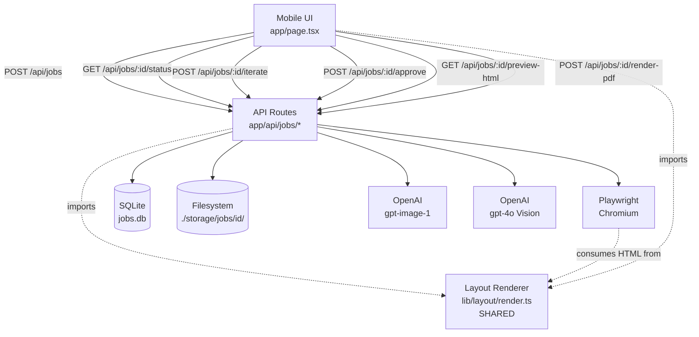
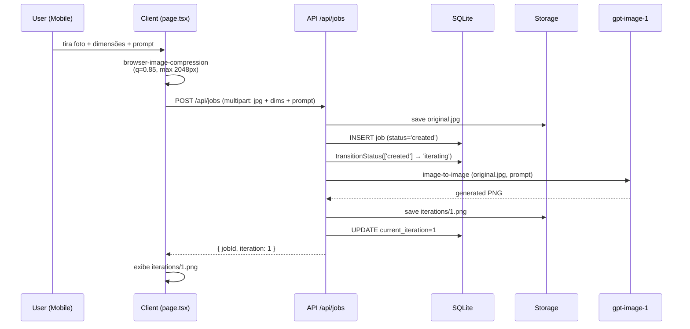
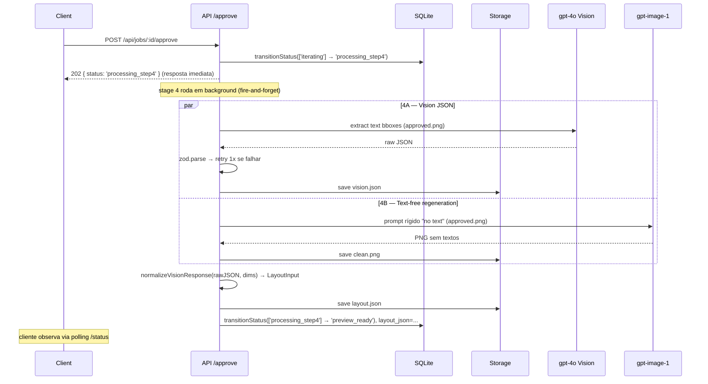
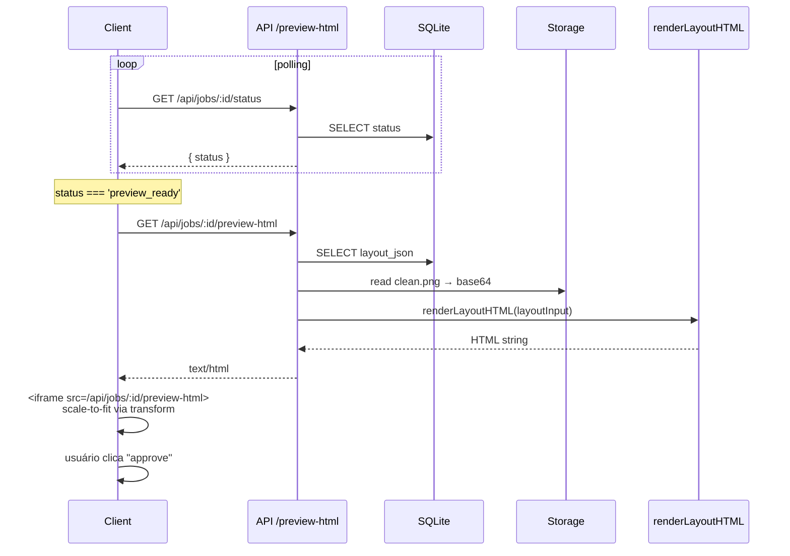
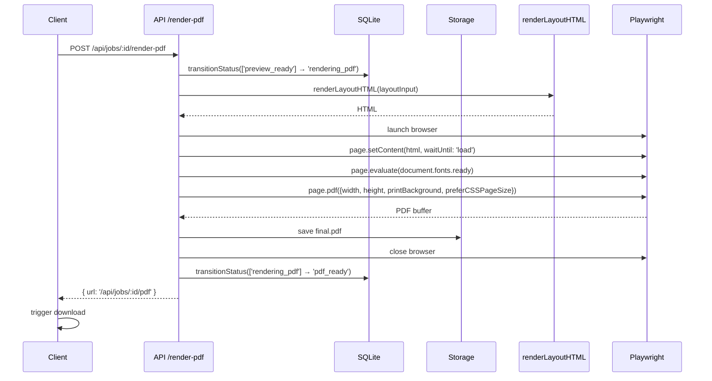
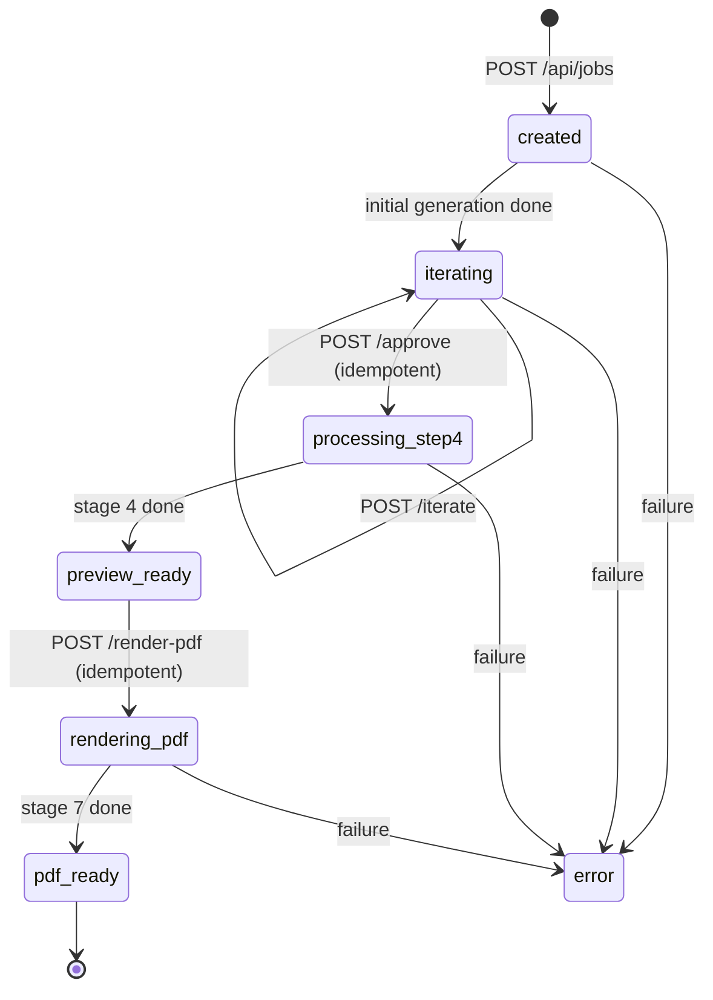

# Design Document: AI Print Art — MVP 1

## Overview

Aplicação web mobile-first que permite a um operador de vendas/design gerar arte impressa física (banners, placas, fachadas) com IA, em frente ao cliente, em poucos minutos. O fluxo é linear, sem retorno: foto → geração inicial → iteração com prompt → aprovação → processamento (Vision + regeneração sem texto) → preview do layout final → aprovação → PDF para download.

O MVP 1 prioriza **validar o fluxo macro** com a menor superfície técnica possível. Stack único Next.js + TypeScript (frontend e backend juntos via API routes), persistência em SQLite com `better-sqlite3` (WAL mode), arquivos no filesystem local em `./storage/jobs/{id}/...`, OpenAI (GPT Image 2 + GPT-4o Vision), Playwright Chromium para HTML→PDF. Sem fila, sem auth, sem upscale, sem prepress — execução síncrona com polling, aceitando todas as limitações conhecidas (distorção por aspect ratio, sem EXIF, sem CMYK).

A peça arquitetural mais crítica é o **Layout Renderer** (`lib/layout/render.ts`): um módulo puro, compartilhado entre cliente e servidor, que é a **única fonte da verdade** para a transformação `LayoutInput → HTML`. O preview na tela e o PDF gerado pelo Playwright consomem exatamente o mesmo HTML, garantindo paridade pixel-a-mm entre o que o operador aprova e o arquivo entregue.

## Architecture

### Diagrama de componentes (alto nível)



### Topologia lógica

- **Cliente (browser mobile)**: captura/upload, compressão, exibição de imagens, polling de status, iframe de preview, trigger de download.
- **Servidor (Next.js API Routes)**: orquestração síncrona, persistência, chamadas à OpenAI, geração de PDF.
- **Estado global**: linha única em `jobs` no SQLite + arquivos em `./storage/jobs/{id}/`. Toda transição é uma mudança de `status` na linha do job.

## Sequence Diagrams

### Stage 1 + 2 — Capture e Initial Generation



### Stage 3 — Iteration loop

```mermaid
sequenceDiagram
    participant U as User
    participant C as Client
    participant A as API /iterate
    participant DB as SQLite
    participant FS as Storage
    participant OAI as gpt-image-1

    loop até aprovação
        U->>C: novo prompt (e/ou nova foto)
        C->>A: POST /api/jobs/:id/iterate
        A->>DB: SELECT job; assert status in ['iterating']
        A->>OAI: image-to-image
        OAI-->>A: PNG
        A->>FS: save iterations/{n+1}.png
        A->>DB: UPDATE current_iteration=n+1
        A-->>C: { iteration: n+1 }
        C->>A: GET /api/jobs/:id/iterations/{n+1}
        A-->>C: image/png stream
    end
    Note over C: usuário clica "approve art" → ver Stage 4
```

### Stage 4 — Vision + Text-Free Regeneration (parallel)



### Stage 5 + 6 — Preview



### Stage 7 — PDF



## State Machine

O `status` da tabela `jobs` é a fonte da verdade do progresso. Transições são lineares (sem retorno), exceto o loop interno de iteração em `iterating`.



### Tabela de transições válidas

| Endpoint | from | to |
|---|---|---|
| `POST /api/jobs` | (none) | `created` → `iterating` |
| `POST /api/jobs/:id/iterate` | `iterating` | `iterating` |
| `POST /api/jobs/:id/approve` | `iterating` | `processing_step4` (background → `preview_ready`) |
| `POST /api/jobs/:id/render-pdf` | `preview_ready` | `rendering_pdf` → `pdf_ready` |
| `GET /api/jobs/:id/status` | * | (read-only) |
| `GET /api/jobs/:id/preview-html` | `preview_ready` ou `pdf_ready` | (read-only) |
| `GET /api/jobs/:id/iterations/:n` | * | (read-only stream do PNG) |
| `GET /api/jobs/:id/pdf` | `pdf_ready` | (read-only stream do PDF) |

Qualquer endpoint chamado fora do estado válido retorna `409 Conflict`.

## Components and Interfaces

### Component 1: Mobile UI (`app/page.tsx`)

**Purpose**: Tela única multi-step (Capture → Iterate → Preview → Done) controlada por estado React local + status do servidor.

**Responsibilities**:
- Captura/upload de imagem com `<input type="file" accept="image/*" capture="environment">`.
- Compressão client-side com `browser-image-compression`.
- POST inicial e iterações.
- Polling de `/status` quando em estado de processamento.
- Renderização de `<iframe src="/api/jobs/:id/preview-html">` com transform de scale dinâmico.
- Trigger de download do PDF.

### Component 2: API Routes (`app/api/jobs/...`)

**Purpose**: Orquestração síncrona de cada estágio. Cada rota é um único handler que executa todas as chamadas até o próximo estado estável.

**Responsibilities**:
- Validar transição de estado antes de agir (idempotência via flag de status no SQLite).
- Persistir resultados em filesystem e atualizar `jobs` em transação SQLite.
- Mapear erros para respostas HTTP (`400`, `409`, `500`).

### Component 3: Database (`lib/db.ts`)

**Purpose**: Wrapper sobre `better-sqlite3` com WAL mode habilitado.

**Interface**:
```ts
export function getDb(): Database;
export function initSchema(): void;

export type JobRow = {
  id: string;
  width_mm: number;
  height_mm: number;
  initial_prompt: string;
  status: JobStatus;
  current_iteration: number;
  layout_json: string | null;
  error_message: string | null;
  created_at: number;
  updated_at: number;
};

export type JobStatus =
  | 'created'
  | 'iterating'
  | 'processing_step4'
  | 'preview_ready'
  | 'rendering_pdf'
  | 'pdf_ready'
  | 'error';

export function insertJob(input: { id: string; widthMm: number; heightMm: number; initialPrompt: string }): void;
export function getJob(id: string): JobRow | null;
export function updateJob(id: string, patch: Partial<JobRow>): void; // patch parcial; status atomico usa transitionStatus
export function transitionStatus(id: string, from: JobStatus[], to: JobStatus): boolean;
```

### Component 4: Storage (`lib/storage.ts`)

**Purpose**: Abstração de filesystem com interface estável (permite trocar por S3 no futuro sem alterar callers).

**Interface**:
```ts
export interface Storage {
  saveBytes(jobId: string, relPath: string, data: Buffer): Promise<void>;
  readBytes(jobId: string, relPath: string): Promise<Buffer>;
  saveJson<T>(jobId: string, relPath: string, value: T): Promise<void>;
  readJson<T>(jobId: string, relPath: string): Promise<T>;
  exists(jobId: string, relPath: string): Promise<boolean>;
  pathFor(jobId: string, relPath: string): string;
}

export const localStorage: Storage; // implementação ./storage/jobs/{id}/...
```

### Component 5: OpenAI Wrappers (`lib/openai.ts`)

**Purpose**: Encapsular chamadas brutas a `gpt-image-1` (image-to-image, regeneração sem texto) e `gpt-4o` Vision. Cada função executa **uma única** chamada à API e retorna o resultado bruto, sem retry interno. O retry específico do Vision (zod parse + 1 retry) vive isolado em `extractLayoutVisionWithRetry` (`lib/openai/visionRetry.ts`), separando o concern de validação do concern de transporte.

**Interface**:
```ts
export async function generateImageToImage(args: {
  baseImage: Buffer;
  prompt: string;
}): Promise<Buffer>; // PNG

export async function regenerateWithoutText(args: {
  baseImage: Buffer;
  originalPrompt: string;
}): Promise<Buffer>; // PNG sem textos

export async function extractLayoutVision(args: {
  image: Buffer;
}): Promise<unknown>; // JSON cru, ainda não validado
```

### Component 6: Layout Renderer (`lib/layout/render.ts`) — **CRITICAL**

**Purpose**: Função pura que converte `LayoutInput` em string HTML. **Único módulo compartilhado entre cliente e servidor** que produz a representação visual final. O preview e o PDF consomem exatamente o mesmo output.

**Interface**:
```ts
export function renderLayoutHTML(input: LayoutInput): string;
```

**Responsibilities**:
- Gerar `<!DOCTYPE html>` completo com `<head>`, `<style>` e `<body>`.
- `@page { size: {W}mm {H}mm; margin: 0 }`.
- Container raiz `position: relative`, dimensões em mm.
- Background como `` filho com `position: absolute`, top/left/width/height = 0/0/100%/100%, `src` = base64 data URL.
- Cada `textElements[i]` como `<div>` filho com `position: absolute`, `left/top/width/height` em mm, tipografia inline.
- Fonte Inter embutida no `<style>` via `@font-face` com `src: url(data:font/woff2;base64,...)`.
- HTML escape em `content` de cada texto.
- Output **determinístico**: mesma entrada → string idêntica byte a byte.

**Constraints**:
- Função síncrona, sem I/O, sem `Date.now()`, sem `Math.random()`.
- Sem dependências fora de `lib/layout/types.ts` e `lib/layout/fonts.ts`.
- Compila em ambiente de cliente (sem `fs`, `path`, etc.).

### Component 7: Vision Normalization (`lib/layout/normalize.ts`)

**Purpose**: Converter resposta crua do Vision em `LayoutInput` validado, com bboxes em mm.

**Interface**:
```ts
export function normalizeVisionResponse(args: {
  raw: unknown;
  imageWidthPx: number;
  imageHeightPx: number;
  canvasWidthMm: number;
  canvasHeightMm: number;
  backgroundDataUrl: string;
}): LayoutInput;
```

### Component 8: PDF (`lib/pdf.ts`)

**Purpose**: Wrapper de Playwright. Abre/fecha browser por job (sem pool no MVP 1).

**Interface**:
```ts
export async function renderPdf(args: {
  html: string;
  widthMm: number;
  heightMm: number;
}): Promise<Buffer>;
```

## Data Models

### Domain Types (`lib/layout/types.ts`)

```ts
export type LayoutInput = {
  canvas: { widthMm: number; heightMm: number };
  background: { dataUrl: string }; // data:image/png;base64,...
  textElements: TextElement[];
};

export type TextElement = {
  id: string;
  content: string;
  position: { xMm: number; yMm: number };
  size: { widthMm: number; heightMm: number };
  typography: {
    fontFamily: string;
    fontSizePx: number;
    fontWeight: number;
    color: string; // CSS color: '#RRGGBB' ou nome
    align: 'left' | 'center' | 'right';
  };
};
```

### Vision Raw Schema (zod)

```ts
import { z } from 'zod';

export const VisionTextElementSchema = z.object({
  content: z.string().min(1),
  bboxPx: z.object({
    x: z.number().nonnegative(),
    y: z.number().nonnegative(),
    width: z.number().positive(),
    height: z.number().positive(),
  }),
  color: z.string(), // hex ou nome CSS
  fontWeight: z.number().int().min(100).max(900),
  align: z.enum(['left', 'center', 'right']),
});

export const VisionResponseSchema = z.object({
  imageWidthPx: z.number().positive(),
  imageHeightPx: z.number().positive(),
  textElements: z.array(VisionTextElementSchema),
});

export type VisionResponse = z.infer<typeof VisionResponseSchema>;
```

**Validation Rules**:
- `bboxPx` dentro dos limites de `imageWidthPx × imageHeightPx` (validação extra após `parse`).
- `fontWeight` múltiplo de 100 (sanitização opcional).
- `content` com newline preservado como `\n`.

### Job Status Enum

```ts
export type JobStatus =
  | 'created'
  | 'iterating'
  | 'processing_step4'
  | 'preview_ready'
  | 'rendering_pdf'
  | 'pdf_ready'
  | 'error';
```

### SQL Schema

```sql
CREATE TABLE IF NOT EXISTS jobs (
  id TEXT PRIMARY KEY,
  width_mm INTEGER NOT NULL,
  height_mm INTEGER NOT NULL,
  initial_prompt TEXT NOT NULL,
  status TEXT NOT NULL CHECK (status IN (
    'created','iterating','processing_step4',
    'preview_ready','rendering_pdf','pdf_ready','error'
  )),
  current_iteration INTEGER NOT NULL DEFAULT 0,
  layout_json TEXT,
  error_message TEXT,
  created_at INTEGER NOT NULL,
  updated_at INTEGER NOT NULL
);

CREATE INDEX IF NOT EXISTS idx_jobs_status ON jobs(status);
```

PRAGMAs aplicados na inicialização:
```sql
PRAGMA journal_mode = WAL;
PRAGMA synchronous = NORMAL;
PRAGMA foreign_keys = ON;
```

## API Contracts

### `POST /api/jobs`

**Request** (multipart/form-data):
- `image`: File (JPG, já comprimido pelo cliente)
- `widthMm`: string (inteiro)
- `heightMm`: string (inteiro)
- `prompt`: string

**Response 200**:
```ts
{ jobId: string; iteration: number; }
```

**Response 400**: validação falhou.

**Side effects**: cria linha em `jobs`, salva `original.jpg` e `iterations/1.png`, transição `created → iterating`.

### `GET /api/jobs/:id/status`

**Response 200**:
```ts
{
  status: JobStatus;
  currentIteration: number;
  errorMessage: string | null;
}
```

### `POST /api/jobs/:id/iterate`

**Request** (multipart/form-data):
- `prompt`: string (obrigatório)
- `image`: File (opcional — nova foto)

**Response 200**:
```ts
{ iteration: number; }
```

**Response 409**: status ≠ `iterating`.

### `POST /api/jobs/:id/approve`

**Request**: vazio.

**Response 202**:
```ts
{ status: 'processing_step4'; }
```

**Idempotency**: `transitionStatus(id, ['iterating'], 'processing_step4')` retorna `true` apenas no primeiro chamado bem-sucedido. Chamadas posteriores em `processing_step4`, `preview_ready` ou `pdf_ready` retornam `202` no-op.

**Side effects** (em background, após o 202): copia `iterations/{n}.png` → `approved.png`, executa Stage 4 em paralelo (vision + clean.png), grava `vision.json`, `clean.png`, `layout.json`, `layout_json` na linha, transição final → `preview_ready`. Falha em qualquer ponto → `status = 'error'`.

### `GET /api/jobs/:id/iterations/:n`

Stream de `iterations/{n}.png` com `Content-Type: image/png`. Resposta 404 se job ou arquivo não existem. Read-only, não dispara transições. Usado pela UI para exibir a iteração corrente sem expor paths do filesystem.

### `GET /api/jobs/:id/preview-html`

**Response 200**: `text/html` — string produzida por `renderLayoutHTML(layoutInput)`.

**Response 409**: status não permite preview ainda.

### `POST /api/jobs/:id/render-pdf`

**Request**: vazio.

**Response 200**:
```ts
{ pdfPath: string; } // path interno servido por GET /api/jobs/:id/pdf
```

**Idempotency**: `transitionStatus(id, ['preview_ready'], 'rendering_pdf')`. Se já em `rendering_pdf`, retorna 202 com `{ status: 'rendering_pdf' }`. Se já em `pdf_ready`, retorna 200 com path existente. Outros estados → 409.

### `GET /api/jobs/:id/pdf`

Stream do `final.pdf` com `Content-Type: application/pdf` e `Content-Disposition: attachment`.

## Storage Layout

```
./storage/
  jobs/
    {jobId}/
      original.jpg          # foto original comprimida
      iterations/
        1.png
        2.png
        ...
        {n}.png
      approved.png          # cópia da iteração aprovada
      clean.png             # regeneração sem texto (Stage 4B)
      vision.json           # resposta crua do Vision (auditoria)
      layout.json           # LayoutInput serializado
      final.pdf             # saída final
```

`layout.json` armazena `LayoutInput` **sem** o `background.dataUrl` (para economizar espaço). O `dataUrl` é re-hidratado em runtime lendo `clean.png` e codificando em base64.

## Algorithmic Pseudocode

### Stage 1 + 2 — `POST /api/jobs`

```ts
async function handlePostJobs(req: Request): Promise<Response> {
  // ASSERT: req has multipart with image, widthMm, heightMm, prompt
  const { image, widthMm, heightMm, prompt } = await parseMultipart(req);

  ASSERT image.size > 0 AND widthMm > 0 AND heightMm > 0 AND prompt.length > 0;

  const jobId = crypto.randomUUID();
  insertJob({ id: jobId, widthMm, heightMm, initialPrompt: prompt });
  // status now = 'created'

  await storage.saveBytes(jobId, 'original.jpg', image.buffer);

  ASSERT transitionStatus(jobId, ['created'], 'iterating');

  const generated = await generateImageToImage({ baseImage: image.buffer, prompt });
  await storage.saveBytes(jobId, 'iterations/1.png', generated);
  updateJob(jobId, { current_iteration: 1 });

  return json({ jobId, iteration: 1 });
}
```

**Preconditions**:
- `image` é JPG válido, já comprimido client-side.
- `widthMm`, `heightMm` são inteiros positivos.
- `prompt` não vazio.

**Postconditions**:
- Linha existe em `jobs` com `status = 'iterating'`, `current_iteration = 1`.
- `original.jpg` e `iterations/1.png` existem em disco.
- Em caso de falha após `INSERT`, status fica `error` com `error_message`.

### Stage 3 — `POST /api/jobs/:id/iterate`

```ts
async function handleIterate(jobId: string, req: Request): Promise<Response> {
  const job = getJob(jobId);
  ASSERT job !== null;
  IF job.status !== 'iterating' THEN return 409;

  const { prompt, image } = await parseMultipart(req);
  ASSERT prompt.length > 0;

  const baseImage = image
    ? image.buffer
    : await storage.readBytes(jobId, `iterations/${job.current_iteration}.png`);

  const next = job.current_iteration + 1;
  const generated = await generateImageToImage({ baseImage, prompt });
  await storage.saveBytes(jobId, `iterations/${next}.png`, generated);
  updateJob(jobId, { current_iteration: next });

  return json({ iteration: next });
}
```

**Loop invariant** (visto do cliente):
- Após cada chamada bem-sucedida, `current_iteration` aumenta em exatamente 1.
- `iterations/{1..current_iteration}.png` existem; iterações descartadas pelo operador permanecem em disco mas não voltam ao UI.

### Stage 4 — `POST /api/jobs/:id/approve`

```ts
async function handleApprove(jobId: string): Promise<Response> {
  const job = getJob(jobId);
  ASSERT job !== null;

  // Idempotency guard
  const transitioned = transitionStatus(jobId, ['iterating'], 'processing_step4');
  IF NOT transitioned THEN
    IF job.status IN ['processing_step4', 'preview_ready', 'pdf_ready'] THEN
      return json(202, { status: job.status }); // no-op
    ELSE
      return 409;

  // Fire-and-forget: dispara stage 4 em background, retorna 202 imediatamente.
  // Cliente acompanha via GET /status (polling).
  void runStage4(jobId, job).catch((err) => {
    updateJob(jobId, { error_message: String(err) });
    transitionStatus(jobId, ['processing_step4'], 'error');
  });

  return json(202, { status: 'processing_step4' });
}

async function runStage4(jobId: string, job: JobRow): Promise<void> {
  const approved = await storage.readBytes(jobId, `iterations/${job.current_iteration}.png`);
  await storage.saveBytes(jobId, 'approved.png', approved);

  // Parallel: 4A (Vision) + 4B (clean regen)
  const [rawVision, cleanPng] = await Promise.all([
    extractLayoutVisionWithRetry(approved, maxRetries=1),
    regenerateWithoutText({ baseImage: approved, originalPrompt: job.initial_prompt }),
  ]);

  await storage.saveJson(jobId, 'vision.json', rawVision);
  await storage.saveBytes(jobId, 'clean.png', cleanPng);

  const cleanDataUrl = `data:image/png;base64,${cleanPng.toString('base64')}`;
  const layoutInput = normalizeVisionResponse({
    raw: rawVision,
    imageWidthPx: rawVision.imageWidthPx,
    imageHeightPx: rawVision.imageHeightPx,
    canvasWidthMm: job.width_mm,
    canvasHeightMm: job.height_mm,
    backgroundDataUrl: cleanDataUrl,
  });

  // Persist without dataUrl to save space
  const persisted = { ...layoutInput, background: { dataUrl: '__deferred__' } };
  await storage.saveJson(jobId, 'layout.json', persisted);
  updateJob(jobId, { layout_json: JSON.stringify(persisted) });

  ASSERT transitionStatus(jobId, ['processing_step4'], 'preview_ready');
}
```

**Preconditions**:
- `job.status === 'iterating'` no primeiro disparo.
- `iterations/{current_iteration}.png` existe.

**Postconditions** (caminho feliz):
- `approved.png`, `clean.png`, `vision.json`, `layout.json` existem.
- `jobs.status = 'preview_ready'`, `jobs.layout_json` populado (com `__deferred__` no `dataUrl`).

**Idempotência**: garantida por `transitionStatus` que usa `UPDATE ... WHERE status IN (?)` e checa `changes()`.

**Modelo de execução**: o handler HTTP retorna 202 imediatamente após a transição inicial. `runStage4` roda em background (fire-and-forget) no mesmo processo Node. Falhas dentro de `runStage4` são capturadas pelo `.catch` e refletidas como `status = 'error'`. O cliente observa o progresso via `GET /api/jobs/:id/status`.

### `extractLayoutVisionWithRetry`

```ts
async function extractLayoutVisionWithRetry(
  approved: Buffer,
  maxRetries: number,
): Promise<VisionResponse> {
  let lastErr: unknown;
  FOR attempt FROM 0 TO maxRetries DO
    const raw = await extractLayoutVision({ image: approved });
    const parsed = VisionResponseSchema.safeParse(raw);
    IF parsed.success THEN return parsed.data;
    lastErr = parsed.error;
  END FOR
  THROW new Error(`Vision validation failed after ${maxRetries + 1} attempts: ${lastErr}`);
}
```

**Loop invariant**: a cada iteração, `attempt ≤ maxRetries`; sai imediatamente no primeiro `success`.

### `normalizeVisionResponse`

```ts
function normalizeVisionResponse(args): LayoutInput {
  const {
    raw, imageWidthPx, imageHeightPx,
    canvasWidthMm, canvasHeightMm, backgroundDataUrl,
  } = args;

  ASSERT imageWidthPx > 0 AND imageHeightPx > 0;
  ASSERT canvasWidthMm > 0 AND canvasHeightMm > 0;

  const sx = canvasWidthMm / imageWidthPx;   // mm per px (X)
  const sy = canvasHeightMm / imageHeightPx; // mm per px (Y)

  const textElements = raw.textElements.map((t, i) => ({
    id: `t${i}`,
    content: t.content,
    position: {
      xMm: clamp(t.bboxPx.x * sx, 0, canvasWidthMm),
      yMm: clamp(t.bboxPx.y * sy, 0, canvasHeightMm),
    },
    size: {
      widthMm: clamp(t.bboxPx.width * sx, 0, canvasWidthMm),
      heightMm: clamp(t.bboxPx.height * sy, 0, canvasHeightMm),
    },
    typography: {
      fontFamily: 'Inter, sans-serif',
      fontSizePx: estimateFontSizePx(t.bboxPx.height, t.content),
      fontWeight: t.fontWeight,
      color: t.color,
      align: t.align,
    },
  }));

  return {
    canvas: { widthMm: canvasWidthMm, heightMm: canvasHeightMm },
    background: { dataUrl: backgroundDataUrl },
    textElements,
  };
}
```

**Preconditions**:
- `raw` já passou por `VisionResponseSchema.parse`.
- Dimensões positivas.

**Postconditions**:
- Todas as bboxes em mm permanecem dentro de `[0, canvas*Mm]`.
- `textElements.length === raw.textElements.length`.
- `id` de cada elemento é único (`t0`, `t1`, ...).

### Stage 5 — `renderLayoutHTML` (CRITICAL)

```ts
function renderLayoutHTML(input: LayoutInput): string {
  ASSERT input.canvas.widthMm > 0 AND input.canvas.heightMm > 0;
  ASSERT input.background.dataUrl.startsWith('data:image/');

  const W = input.canvas.widthMm;
  const H = input.canvas.heightMm;

  const fontFace = `
    @font-face {
      font-family: 'Inter';
      font-weight: 100 900;
      font-style: normal;
      src: url(${INTER_VARIABLE_BASE64}) format('woff2-variations');
      font-display: block;
    }
  `;

  const pageRule = `@page { size: ${W}mm ${H}mm; margin: 0 }`;

  const root = `
    *, *::before, *::after { box-sizing: border-box }
    html, body { margin: 0; padding: 0 }
    .canvas {
      position: relative;
      width: ${W}mm;
      height: ${H}mm;
      overflow: hidden;
    }
    .canvas > .bg {
      position: absolute;
      left: 0; top: 0;
      width: 100%; height: 100%;
      object-fit: fill; /* aspect mismatch is intentionally accepted */
    }
    .canvas > .text {
      position: absolute;
      display: flex;
      align-items: center;
      font-family: 'Inter', sans-serif;
      white-space: pre-wrap;
      word-break: break-word;
    }
  `;

  const textNodes = input.textElements
    .map((t) => renderTextNode(t))
    .join('');

  return `<!DOCTYPE html>
<html>
<head>
<meta charset="utf-8">
<style>
${fontFace}
${pageRule}
${root}
</style>
</head>
<body>
<div class="canvas">
  
  ${textNodes}
</div>
</body>
</html>`;
}

function renderTextNode(t: TextElement): string {
  const justify =
    t.typography.align === 'left'   ? 'flex-start' :
    t.typography.align === 'right'  ? 'flex-end'   :
                                      'center';

  const style = [
    `left:${t.position.xMm}mm`,
    `top:${t.position.yMm}mm`,
    `width:${t.size.widthMm}mm`,
    `height:${t.size.heightMm}mm`,
    `font-size:${t.typography.fontSizePx}px`,
    `font-weight:${t.typography.fontWeight}`,
    `color:${t.typography.color}`,
    `text-align:${t.typography.align}`,
    `justify-content:${justify}`,
  ].join(';');

  return `<div class="text" data-id="${escapeHtml(t.id)}" style="${style}">${escapeHtml(t.content)}</div>`;
}
```

**Preconditions**:
- `input` é estruturalmente válido (validado a montante).
- `INTER_VARIABLE_BASE64` é uma constante string carregada de `lib/layout/fonts.ts`.

**Postconditions**:
- Output é determinístico: `renderLayoutHTML(x) === renderLayoutHTML(x)` para qualquer `x`.
- HTML contém exatamente um `.canvas`, exatamente uma ``, e `input.textElements.length` `<div class="text">`.
- Todo `content` é HTML-escaped.
- Nenhum I/O, nenhum estado global.

**Loop invariant** (no `map` de `textElements`):
- Antes/depois de cada iteração, `textNodes` contém exatamente os primeiros `i` elementos serializados em ordem.

### Stage 7 — `renderPdf`

```ts
async function renderPdf(args): Promise<Buffer> {
  const { html, widthMm, heightMm } = args;
  ASSERT widthMm > 0 AND heightMm > 0;

  const browser = await chromium.launch({ headless: true });
  TRY {
    const page = await browser.newPage();
    await page.setContent(html, { waitUntil: 'load' });
    await page.evaluate(() => document.fonts.ready);
    const pdf = await page.pdf({
      width: `${widthMm}mm`,
      height: `${heightMm}mm`,
      printBackground: true,
      preferCSSPageSize: true,
    });
    return pdf;
  } FINALLY {
    await browser.close();
  }
}
```

**Preconditions**:
- `html` é o output exato de `renderLayoutHTML(layoutInput)`.
- Dimensões em mm coincidem com `layoutInput.canvas.*`.

**Postconditions**:
- PDF de página única, dimensões físicas coincidem com `layoutInput.canvas`.
- Background e texto estão presentes (verificável visualmente; `printBackground: true` é mandatório).
- `document.fonts.ready` resolveu antes do `page.pdf`, garantindo Inter aplicado.

## Key Functions with Formal Specifications

### `transitionStatus(id, from, to)`

```ts
function transitionStatus(id: string, from: JobStatus[], to: JobStatus): boolean
```

**Preconditions**:
- `id` é UUID válido.
- `from` é array não-vazio de status válidos.

**Postconditions**:
- Retorna `true` se o `UPDATE jobs SET status = ? WHERE id = ? AND status IN (?...)` afetou exatamente 1 linha.
- Retorna `false` caso contrário (sem efeito colateral).
- Operação atômica via SQLite (single-statement UPDATE).

**Correctness**: dois disparos concorrentes da mesma transição produzem exatamente um `true` e um `false`.

### `renderLayoutHTML(input)` — propriedades formais

```ts
function renderLayoutHTML(input: LayoutInput): string
```

**Preconditions**:
- `input.canvas.widthMm > 0 && input.canvas.heightMm > 0`.
- `input.background.dataUrl` começa com `data:image/`.
- Para cada `t ∈ input.textElements`: `t.position.{x,y}Mm ≥ 0`, `t.size.{width,height}Mm > 0`.

**Postconditions**:
- **Determinismo**: ∀ x, renderLayoutHTML(x) === renderLayoutHTML(x).
- **Pureza**: sem I/O, sem mutação de `input`, sem dependência de tempo/aleatoriedade.
- **Completude**: o HTML inclui `@page`, fonte embutida, background como `` data-URL, e um `<div class="text">` por elemento, na ordem original.
- **Escape**: para todo `t.content`, `c ∈ {<, >, &, ", '}` aparece como entidade HTML, não literal.

### `normalizeVisionResponse(args)` — propriedades formais

**Preconditions**:
- Schema zod já validado.
- Dimensões em px e mm positivas.

**Postconditions**:
- ∀ `t` em saída: `0 ≤ t.position.xMm ≤ canvasWidthMm` ∧ `0 ≤ t.position.yMm ≤ canvasHeightMm`.
- ∀ `t`: `t.size.widthMm + t.position.xMm ≤ canvasWidthMm` (após clamp).
- `output.textElements.length === raw.textElements.length`.
- IDs são únicos (`t0..tN-1`).

## Example Usage

### Cliente — Stage 1

```tsx
async function handleSubmit(form: FormData) {
  const file = form.get('image') as File;
  const compressed = await imageCompression(file, {
    maxSizeMB: 4,
    maxWidthOrHeight: 2048,
    initialQuality: 0.85,
    fileType: 'image/jpeg',
  });

  const fd = new FormData();
  fd.set('image', compressed);
  fd.set('widthMm', String(form.get('widthMm')));
  fd.set('heightMm', String(form.get('heightMm')));
  fd.set('prompt', String(form.get('prompt')));

  const res = await fetch('/api/jobs', { method: 'POST', body: fd });
  const { jobId } = await res.json();
  setState({ phase: 'iterating', jobId, iteration: 1 });
}
```

### Cliente — polling de status

```tsx
useEffect(() => {
  if (!shouldPoll(state.phase)) return;
  const t = setInterval(async () => {
    const r = await fetch(`/api/jobs/${jobId}/status`).then(r => r.json());
    setState(s => ({ ...s, status: r.status }));
    if (r.status === 'preview_ready') clearInterval(t);
  }, 1500);
  return () => clearInterval(t);
}, [state.phase, jobId]);
```

### Cliente — preview com transform de scale

```tsx
function PreviewFrame({ jobId, widthMm, heightMm }: Props) {
  const containerRef = useRef<HTMLDivElement>(null);
  const [scale, setScale] = useState(1);

  const recompute = useCallback(() => {
    const el = containerRef.current;
    if (!el) return;
    const cw = el.clientWidth;
    const ch = el.clientHeight;
    const ratioW = cw / mmToPx(widthMm);
    const ratioH = ch / mmToPx(heightMm);
    setScale(Math.min(ratioW, ratioH));
  }, [widthMm, heightMm]);

  useEffect(() => {
    recompute();
    window.addEventListener('resize', recompute);
    return () => window.removeEventListener('resize', recompute);
  }, [recompute]);

  return (
    <div ref={containerRef} className="preview-container">
      <iframe
        src={`/api/jobs/${jobId}/preview-html`}
        style={{
          width: `${mmToPx(widthMm)}px`,
          height: `${mmToPx(heightMm)}px`,
          transform: `scale(${scale})`,
          transformOrigin: 'top left',
          border: 0,
        }}
        onLoad={recompute}
      />
    </div>
  );
}
```

### Servidor — preview HTML route

```ts
export async function GET(_: Request, { params }: { params: { id: string } }) {
  const job = getJob(params.id);
  if (!job) return new Response('Not found', { status: 404 });
  if (job.status !== 'preview_ready' && job.status !== 'pdf_ready') {
    return new Response('Not ready', { status: 409 });
  }

  const persisted = JSON.parse(job.layout_json!) as LayoutInput;
  const cleanBuf = await localStorage.readBytes(job.id, 'clean.png');
  const dataUrl = `data:image/png;base64,${cleanBuf.toString('base64')}`;

  const layoutInput: LayoutInput = {
    ...persisted,
    background: { dataUrl },
  };

  const html = renderLayoutHTML(layoutInput);
  return new Response(html, {
    status: 200,
    headers: { 'Content-Type': 'text/html; charset=utf-8' },
  });
}
```

## Correctness Properties

Estas propriedades guiam a estratégia de testes (property-based testing onde aplicável).

### P1 — Determinismo do Layout Renderer

```ts
∀ input: LayoutInput,
  renderLayoutHTML(input) === renderLayoutHTML(input)
```

Mesma entrada → string byte-a-byte idêntica. Sem `Date`, `Math.random`, ordenação não-determinística.

### P2 — Pureza do Layout Renderer

```ts
∀ input: LayoutInput,
  renderLayoutHTML(input) não realiza I/O
  ∧ não muta input (deep equality preservada)
```

### P3 — Idempotência das transições críticas

```ts
∀ jobId,
  let r1 = transitionStatus(jobId, ['iterating'], 'processing_step4');
  let r2 = transitionStatus(jobId, ['iterating'], 'processing_step4');
  (r1 ∨ r2) ∧ ¬(r1 ∧ r2)   // exatamente uma é true
```

Mesma propriedade vale para `preview_ready → rendering_pdf`.

### P4 — Consistência do polling state machine

A sequência de `status` observada por um cliente que faz polling repetido é **monotônica** dentro do conjunto válido:

```
created → iterating → (iterating)* → processing_step4 → preview_ready → rendering_pdf → pdf_ready
```

Nenhum status "anda para trás", exceto via transição final para `error`.

### P5 — Integridade do background base64

```ts
∀ jobId tal que clean.png existe,
  let html = renderLayoutHTML(layoutInputFor(jobId));
  let dataUrl = extractBackgroundSrc(html);
  base64Decode(stripDataUrlPrefix(dataUrl)) === readBytes('clean.png')
```

O background embutido no HTML é byte-equivalente ao arquivo `clean.png`.

### P6 — Integridade da fonte embutida

```ts
∀ html = renderLayoutHTML(_),
  html contém exatamente uma @font-face Inter
  ∧ src: url(data:font/woff2;base64,...) é decodificável como WOFF2 válido
```

Verificação: o HTML emitido referencia a constante `INTER_VARIABLE_BASE64` definida em `lib/layout/fonts.ts`. A integridade do binário é verificada como **teste de constante** em `tests/layout/fonts.test.ts` (decoda o base64 e checa o magic number `wOF2` no início), não como property test do renderer.

### P7 — Estabilidade dimensional

```ts
∀ LayoutInput input com canvas {W, H} mm,
  renderLayoutHTML(input) contém:
    - @page { size: W mm H mm }
    - .canvas com width: W mm, height: H mm
```

PDF gerado com Playwright tem `page.pdf({ width: ${W}mm, height: ${H}mm })` coincidente.

### P8 — Bounds das bboxes após normalização

```ts
∀ raw VisionResponse válido, ∀ canvas {W, H} mm,
  let layout = normalizeVisionResponse({raw, ..., W, H});
  ∀ t ∈ layout.textElements,
    0 ≤ t.position.xMm ≤ W
    ∧ 0 ≤ t.position.yMm ≤ H
    ∧ t.position.xMm + t.size.widthMm ≤ W
    ∧ t.position.yMm + t.size.heightMm ≤ H
```

### P9 — HTML escape

```ts
∀ t com t.content contendo '<', '>', '&', '"', "'",
  o output de renderLayoutHTML não contém esses caracteres como literais
  fora de contextos válidos (atributos style, etc.)
```

### P10 — Playwright fonts.ready antes de page.pdf

Asserção operacional: o pipeline em `renderPdf` chama `document.fonts.ready` **antes** de `page.pdf`, garantindo que glifos Inter estejam carregados no PDF resultante. Ausência dessa await produziria fallback de fonte e quebra visual.

## Error Handling

### Cenário 1: Falha do GPT Image 2 na geração inicial

**Condição**: chamada à OpenAI lança erro (rede, rate, conteúdo).
**Resposta**: `updateJob(id, { error_message })` + `transitionStatus(id, [<status corrente>], 'error')` (status só muda via `transitionStatus`). HTTP 500 com `{ error }`.
**Recuperação**: cliente exibe erro e oferece "tentar novamente" (que faz novo `POST /api/jobs`, criando novo job).

### Cenário 2: Falha de validação zod na resposta do Vision

**Condição**: `VisionResponseSchema.parse` rejeita após 1 retry.
**Resposta**: status → `error`, `error_message = 'vision_validation_failed'`.
**Recuperação**: cliente mostra erro. Operador pode aprovar nova iteração (novo `approve` em outro job).

### Cenário 3: Status já avançado quando endpoint é chamado de novo

**Condição**: cliente faz double-click em "approve" ou "render-pdf".
**Resposta**: idempotência via `transitionStatus`. Para `/approve`, segunda chamada vê `processing_step4`/`preview_ready`/`pdf_ready` e retorna **202** com o status corrente. Para `/render-pdf`, segunda chamada com `rendering_pdf`/`pdf_ready` retorna **202**/**200** respectivamente, conforme contratos da API.

### Cenário 4: Playwright falha (browser crash, timeout)

**Condição**: `chromium.launch()` ou `page.pdf()` lança.
**Resposta**: status → `error`. Browser fechado no `finally`.
**Recuperação**: operador clica de novo em "render PDF". Rota detecta status `error` e (no MVP 1) retorna 500 — operador recria o job. *(Não há retry automático no MVP 1.)*

### Cenário 5: `clean.png` ausente no momento do preview

**Condição**: arquivo deletado externamente ou `approve` falhou no meio.
**Resposta**: 500. Operador deve recriar o job.

### Cenário 6: Dimensões inválidas na entrada

**Condição**: `widthMm` ou `heightMm` ≤ 0, ou não inteiro.
**Resposta**: 400 antes de qualquer side-effect.

## Testing Strategy

### Unit Testing

- `lib/layout/render.ts` — testes de saída exata para entradas conhecidas (snapshot), incluindo:
  - Zero text elements.
  - 1, 5, 50 text elements.
  - Caracteres especiais em `content`.
  - Cores hex e nomeadas.
- `lib/layout/normalize.ts` — bbox em px → mm com escalas conhecidas; clamp em bordas.
- `lib/db.ts` — `transitionStatus` com SQLite in-memory.
- `lib/openai.ts` — mocks de SDK.

### Property-Based Testing

**Library**: `fast-check`.

Propriedades a serem cobertas:
- **P1 Determinismo**: gerar `LayoutInput` aleatório, chamar `renderLayoutHTML` duas vezes, asserir igualdade.
- **P2 Pureza**: snapshot do `input` antes/depois, asserir deep-equal.
- **P8 Bounds**: gerar `VisionResponse` com bboxes em px arbitrárias, asserir clamping correto.
- **P9 HTML escape**: `content` arbitrário, asserir ausência de tag injection extraindo o `<div data-id="${id}">` via regex e comparando o `content` decodificado.
- **P3 Idempotência**: simular concorrência (Promise.all de duas transições), asserir exatamente uma `true`.

### Integration Testing

- Stage 1 → Stage 7 end-to-end com mocks de OpenAI (fixtures de imagens) e Playwright real.
- Verificar que o PDF gerado tem `mediaBox` igual a `widthMm × heightMm` (via parser PDF como `pdf-parse` ou checagem binária).
- Verificar que o `<iframe>` do preview e o PDF compartilham o mesmo HTML (capturar bytes em ambos os caminhos e comparar).

## Performance Considerations

MVP 1 é otimizado para **um operador por vez**. Não há fila nem pool; cada job ocupa um Chromium efêmero na fase 7. Tempos esperados:

- Stage 2 (gpt-image-1 i2i): 10–40s.
- Stage 3 por iteração: 10–40s.
- Stage 4 paralelo: max(Vision, gpt-image-1) ≈ 15–45s.
- Stage 7 (Playwright open + PDF + close): 3–8s.

A compressão client-side (q≈0.85, max 2048px) garante uploads <2 MB típicos. Polling em 1.5 s é suficiente; sem long-polling/SSE.

Decisão consciente: HTML carrega background base64 inline (PNG potencialmente >5 MB embutido). Trade-off aceito para simplicidade e portabilidade do HTML único entre preview e PDF.

## Security Considerations

- **Sem auth**: aceitar premissa do MVP. Acesso por URL (UUID v4 do job) é o único "segredo".
- **HTML escape obrigatório** em `content` para impedir injeção via prompt malicioso → Vision → texto inserido no HTML.
- **OpenAI API key** lida apenas no servidor via env var; nunca exposta ao cliente.
- **Filesystem path traversal**: `storage.ts` constrói paths via `path.join` com validação de `jobId` (apenas UUIDs aceitos via regex).
- **Tamanho de upload**: limite hard de 10 MB em `POST /api/jobs` para evitar exaustão de disco.

## Dependencies

| Pacote | Versão alvo | Uso |
|---|---|---|
| `next` | 14.x | framework |
| `react`, `react-dom` | 18.x | UI |
| `typescript` | 5.x | tipagem |
| `better-sqlite3` | 11.x | persistência |
| `zod` | 3.x | validação |
| `openai` | 4.x | SDK GPT Image 2 + Vision |
| `playwright` | 1.x | Chromium headless |
| `browser-image-compression` | 2.x | compressão client-side |
| `fast-check` | 3.x | property-based testing (dev) |
| `vitest` ou `jest` | latest | test runner (dev) |

Fonte Inter Variable (woff2) baixada uma vez e versionada em `lib/layout/fonts.ts` como string base64.

Sem dependências adicionais: nenhum `sharp`, nenhum `tesseract`, nenhum `bullmq`, nenhum `next-auth`. Esta é a superfície completa do MVP 1.
