# Implementation Plan: AI Print Art — MVP 1

## Overview

Plano de implementação derivado de `design.md` e `requirements.md`. Stack fixa: Next.js 14 (App Router) + React 18 + TypeScript 5 + `better-sqlite3` (WAL) + filesystem local + OpenAI SDK (`gpt-image-1`, `gpt-4o`) + Playwright Chromium + `zod` + `browser-image-compression` + `fast-check` + Vitest.

A estratégia de execução parte do núcleo puro (Layout Renderer + Normalizer + State Machine) com property-based testing antes ou em paralelo à integração I/O, depois sobe a stack: Storage, OpenAI/PDF wrappers, rotas API, UI mobile, e por fim um teste integrado fim-a-fim com OpenAI mockado e Playwright real.

> Convenção: o conteúdo das tasks está em pt-BR, mas todos os identificadores, paths, comandos, palavras-chave técnicas e código-exemplo permanecem em inglês.

> Tasks marcadas com `*` são opcionais (testes). O agente NÃO deve implementá-las automaticamente; tasks sem `*` são obrigatórias.

## Tasks

- [x] 1. Scaffolding do projeto Next.js + TypeScript
  - Inicializar projeto Next.js 14 (App Router) com TypeScript estrito em `tsconfig.json` (`"strict": true`, `"noUncheckedIndexedAccess": true`).
  - Estruturar diretórios: `app/`, `app/api/jobs/`, `lib/`, `lib/layout/`, `tests/`, `storage/jobs/` (criado em runtime, com `.gitkeep`).
  - Configurar `package.json` com scripts: `dev`, `build`, `start`, `test` (Vitest com `--run`), `test:watch`, `lint`.
  - Criar `.env.example` com `OPENAI_API_KEY=` e `.gitignore` cobrindo `node_modules/`, `.next/`, `storage/jobs/*`, `*.db`, `*.db-*`, `.env`.
  - Adicionar `next.config.js` habilitando server actions/route handlers padrão e `experimental.serverComponentsExternalPackages = ['better-sqlite3', 'playwright']`.
  - _Requirements: 15.1, 15.2_

- [x] 2. Instalação de dependências fixas do MVP
  - Instalar runtime: `next@14`, `react@18`, `react-dom@18`, `better-sqlite3@11`, `zod@3`, `openai@4`, `playwright@1`, `browser-image-compression@2`.
  - Instalar dev: `typescript@5`, `@types/node`, `@types/react`, `@types/better-sqlite3`, `vitest`, `@vitest/ui`, `fast-check@3`, `tsx`, `eslint`, `eslint-config-next`.
  - Rodar `npx playwright install chromium` no postinstall via script `postinstall` (ou documentar no README).
  - NÃO instalar nenhum dos pacotes fora de escopo: `sharp`, `tesseract.js`, `bullmq`, `next-auth`, `pdf-lib`, etc.
  - _Requirements: Dependencies (design.md)_

- [x] 3. Tipos de domínio do layout (`lib/layout/types.ts`)
  - Declarar `LayoutInput`, `TextElement`, `JobStatus` exatamente como na seção "Domain Types" do design.
  - Garantir que o módulo é puramente de tipos (`export type ...`), sem runtime side-effects, importável tanto no client quanto no server.
  - _Requirements: 8.1, 12.1_

- [x] 4. Constante de fonte Inter Variable (`lib/layout/fonts.ts`)
  - Baixar Inter Variable woff2 (peso 100–900) uma vez e versionar como string base64 exportada como `INTER_VARIABLE_BASE64`.
  - Procedimento documentado em README: origem do arquivo (rsms.me/inter ou GitHub oficial), processo de codificação base64, e forma de atualização caso a fonte precise ser substituída no futuro.
  - Garantir que o módulo é compatível com cliente (apenas string constante, sem `Buffer`/`fs`).
  - **Teste de constante (obrigatório, em `tests/layout/fonts.test.ts`)**: decodificar `INTER_VARIABLE_BASE64` (via `Buffer.from(s, 'base64')`) e asserir que os primeiros 4 bytes são `0x77 0x4F 0x46 0x32` (`wOF2` em ASCII, magic number do WOFF2). Sem hash SHA256, sem comparação binária total.
  - _Requirements: 8.7, 16.6 (P6)_

- [ ] 5. Layout Renderer puro (`lib/layout/render.ts`)
  - [x] 5.1 Implementar `escapeHtml(input: string): string` interno cobrindo `<`, `>`, `&`, `"`, `'`.
    - Função pura, sem regex global state. Tabela determinística de substituição.
    - _Requirements: 8.10, 16.9 (P9)_

  - [x] 5.2 Implementar `renderLayoutHTML(input: LayoutInput): string`
    - Saída: `<!DOCTYPE html>` + `<html><head><meta charset="utf-8"></head><body>…</body></html>`.
    - `<style>` deve conter exatamente: uma `@font-face` Inter usando `INTER_VARIABLE_BASE64` (P6); uma `@page { size: ${W}mm ${H}mm; margin: 0 }` (P7); regras `.canvas`, `.canvas > .bg`, `.canvas > .text` conforme pseudocódigo "Stage 5".
    - `.canvas`: `position: relative; width: ${W}mm; height: ${H}mm; overflow: hidden`.
    - Renderizar background como ``.
    - Renderizar cada `t ∈ input.textElements` como `
${escapeHtml(t.content)}
` na ordem original; estilo inline com `left/top/width/height` em mm e `font-size`, `font-weight`, `color`, `text-align`, `justify-content` derivado de `align`.
    - Função SÍNCRONA, sem `Date.now()`, `Math.random()`, sem I/O, sem `fs`, sem `path`, sem mutação de `input`.
    - Saída byte-a-byte determinística (P1) e pura (P2).
    - **Requisitos críticos a respeitar literalmente: P1 (determinismo), P2 (pureza), P9 (escape HTML).**
    - _Requirements: 8.1, 8.2, 8.3, 8.4, 8.5, 8.6, 8.7, 8.8, 8.9, 8.10, 8.11_

  - [x] 5.3 Property test P1 — Determinismo do Layout Renderer (`tests/layout/render.p1.pbt.test.ts`)
    - **Property P1: Determinismo**
    - Usar `fast-check` para gerar `LayoutInput` arbitrário (canvas com mm em `[10, 5000]`, `textElements.length ∈ [0, 50]`, `content` arbitrário incluindo unicode, especiais e newline; bboxes dentro do canvas; cores hex e nomes; `align ∈ ['left','center','right']`; `fontWeight` múltiplo de 100 em `[100,900]`).
    - Asserção: `renderLayoutHTML(input) === renderLayoutHTML(input)`.
    - _Validates: Requirements 8.3, 16.1_

  - [x] 5.4 Property test P2 — Pureza do Layout Renderer (`tests/layout/render.p2.pbt.test.ts`)
    - **Property P2: Pureza (sem mutação)**
    - Clonar `input` via `structuredClone` antes da chamada; após `renderLayoutHTML(input)`, asserir `deepEqual(input, clone)`.
    - Verificar adicionalmente que nenhuma chamada a `fs`, `process.hrtime`, `Date.now`, `Math.random` ocorre (mockando-as e asserindo `not.toHaveBeenCalled`).
    - _Validates: Requirements 16.2_

  - [x] 5.5 Property test P9 — HTML escape sem injeção (`tests/layout/render.p9.pbt.test.ts`)
    - **Property P9: HTML escape**
    - Gerar `content` arbitrário (incluindo `<script>`, `
`, `&amp;`, aspas duplas/simples, `>` e `<` aleatórios).
    - Estratégia de verificação (sem dep nova): para cada `text element` injetado, extrair o `
...
` correspondente do HTML via regex ancorada no `data-id` único; após a regex, decodificar entidades (`&lt;`, `&gt;`, `&amp;`, `&quot;`, `&#x27;`) e asserir que o resultado é igual ao `t.content` original.
    - Asserir que o HTML completo NÃO contém `t.content` literalmente em qualquer ponto fora de contextos seguros (ex.: nenhum `<script>` ou tag arbitrária criada por `content` malicioso).
    - _Validates: Requirements 8.10, 16.9_

  - [x] 5.6 Property test P7 — Estabilidade dimensional (`tests/layout/render.p7.pbt.test.ts`)
    - **Property P7: Estabilidade dimensional**
    - Para `LayoutInput` arbitrário com canvas `{W,H}`, asserir que o HTML contém literalmente `@page { size: ${W}mm ${H}mm; margin: 0 }` e `.canvas` tem `width:${W}mm` e `height:${H}mm`.
    - _Validates: Requirements 8.6, 8.11, 16.7_

  - [-] 5.7 Snapshot test do Layout Renderer (`tests/layout/render.snapshot.test.ts`)
    - Cobrir 0 / 1 / 5 / 50 elementos, cores hex e nomeadas, conteúdo com newline e caracteres especiais.
    - _Validates: Requirements 8.5, 8.9_

- [x] 6. Vision Normalizer (`lib/layout/normalize.ts`)
  - [x] 6.1 Definir `VisionTextElementSchema` e `VisionResponseSchema` com `zod` exatamente como em "Vision Raw Schema".
    - Validar `imageWidthPx > 0`, `imageHeightPx > 0`, `bboxPx.width > 0`, `bboxPx.height > 0`, `fontWeight` inteiro `[100,900]`, `align ∈ ['left','center','right']`, `content` não vazio.
    - Exportar tipo `VisionResponse = z.infer<typeof VisionResponseSchema>`.
    - _Requirements: 5.2_

  - [x] 6.2 Implementar `normalizeVisionResponse(args)` retornando `LayoutInput`
    - Calcular `sx = canvasWidthMm / imageWidthPx` e `sy = canvasHeightMm / imageHeightPx`.
    - Aplicar clamp `[0, canvas*Mm]` em `position.xMm`, `position.yMm`, `size.widthMm`, `size.heightMm`. Adicionalmente garantir `position.{x,y}Mm + size.{width,height}Mm ≤ canvas*Mm` (clamp do tamanho ao espaço restante).
    - Atribuir `id = 't${i}'` na ordem original, preservando `textElements.length`.
    - `typography.fontFamily = 'Inter, sans-serif'` para todos.
    - Implementar `estimateFontSizePx(bboxHeightPx, content)` heurística simples (ex.: `Math.max(8, Math.round(bboxHeightPx * 0.7))`).
    - Função pura, sem I/O.
    - _Requirements: 7.1, 7.2, 7.3, 7.4, 7.5, 7.6, 7.7_

  - [~] 6.3 Property test P8 — Bounds das bboxes (`tests/layout/normalize.p8.pbt.test.ts`)
    - **Property P8: Bounds**
    - Gerar `VisionResponse` válido (passando o schema) com bboxes em px potencialmente excedentes ao canvas; canvas `{W,H}` em `[10, 5000]` mm.
    - Asserir, para todo `t` em `output.textElements`: `0 ≤ xMm ≤ W`, `0 ≤ yMm ≤ H`, `xMm + widthMm ≤ W`, `yMm + heightMm ≤ H`.
    - Asserir `output.textElements.length === raw.textElements.length` e `id` único `t0..t{n-1}`.
    - _Validates: Requirements 7.3, 7.4, 7.6, 16.8_

  - [~] 6.4 Unit tests adicionais do Normalizer (`tests/layout/normalize.test.ts`)
    - Casos: imagem 1000x500 px → canvas 200x100 mm com escala 0.2; bboxes na borda; bboxes com (x,y) negativos rejeitados pelo schema; preserva newlines em `content`.
    - _Requirements: 7.1, 7.2, 5.2_

- [x] 7. Database layer com better-sqlite3 (`lib/db.ts`)
  - [x] 7.1 Implementar `getDb()` singleton, `initSchema()` aplicando o `CREATE TABLE jobs` e PRAGMAs
  - [x] 7.2 Implementar `insertJob`, `getJob`, `updateJob`, `transitionStatus`
    - `transitionStatus`: único `UPDATE jobs SET status = ?, updated_at = ? WHERE id = ? AND status IN (?, ?, ...)` retornando `stmt.changes === 1`. **Único ponto autorizado a alterar a coluna `status`.**
    - `updateJob(id, patch: Partial<JobRow>)`: aplica patch parcial mapeado para colunas conhecidas (`current_iteration`, `layout_json`, `error_message`, `updated_at`). **NÃO aceita `status` no patch** — qualquer mudança de status deve passar por `transitionStatus`.
    - Tipos `JobRow` e `JobStatus` exatamente como em "Component 3" (sem `approved`).
    - _Requirements: 12.1, 12.2, 12.3_

  - [~] 7.3 Property test P3 — Idempotência de transitionStatus (`tests/db/transition.p3.pbt.test.ts`)
    - **Property P3: Idempotência atômica**
    - Usar SQLite in-memory ou tmpdir. Para cada caso gerado: criar job em `from`, executar `Promise.all([transitionStatus(id, [from], to), transitionStatus(id, [from], to)])`.
    - Asserir `(r1 || r2) && !(r1 && r2)` (exatamente uma `true`).
    - Repetir para os pares críticos: `iterating → processing_step4`, `preview_ready → rendering_pdf`.
    - _Validates: Requirements 12.3, 16.3_

  - [~] 7.4 Unit tests do schema e helpers (`tests/db/schema.test.ts`)
    - Verificar PRAGMAs aplicados (`PRAGMA journal_mode`, `synchronous`, `foreign_keys`).
    - `CHECK (status IN (...))` rejeita status inválido.
    - `insertJob` + `getJob` round-trip preserva campos.
    - _Requirements: 12.1, 12.6_

- [x] 8. Storage abstraction (`lib/storage.ts`)
  - Implementar interface `Storage` (assinatura idêntica ao Component 4) e `localStorage: Storage` baseada em `fs/promises` + `path.join`.
  - Validar `jobId` com regex UUID v4 antes de qualquer operação; rejeitar com erro tipado se inválido.
  - Diretório base configurável via `STORAGE_ROOT` (default `./storage/jobs`).
  - `pathFor` é o único ponto autorizado a montar paths absolutos. Outras camadas só consomem essa interface.
  - _Requirements: 15.1, 15.2, 15.3, 15.4, 15.6_

- [~] 8.1 Unit tests de Storage (`tests/storage/local.test.ts`)
  - Round-trip `saveBytes`/`readBytes`, `saveJson`/`readJson`, `exists`.
  - Rejeição de `jobId` inválido (não-UUID, com `..`, com `/`).
  - Persistência de `layout.json` com `background.dataUrl = '__deferred__'` (caller já passa o objeto sanitizado).
  - _Requirements: 15.1, 15.3, 15.4, 15.5_

- [x] 9. OpenAI wrappers (`lib/openai.ts`)
  - [x] 9.1 Implementar cliente OpenAI singleton
  - [x] 9.2 Implementar `generateImageToImage`
  - [x] 9.3 Implementar `regenerateWithoutText`
  - [x] 9.4 Implementar `extractLayoutVision`

  - [~] 9.5 Unit tests com mock do SDK (`tests/openai/wrappers.test.ts`)
    - Mock de `openai` para asserir parâmetros enviados (modelo, mensagem, formato esperado).
    - _Requirements: 2.2, 5.1, 6.1_

- [x] 10. PDF wrapper Playwright (`lib/pdf.ts`)
  - Implementar `renderPdf({ html, widthMm, heightMm })` exatamente conforme pseudocódigo "Stage 7".
  - Sequência obrigatória: `chromium.launch({ headless: true })` → `browser.newPage()` → `page.setContent(html, { waitUntil: 'load' })` → **`await page.evaluate(() => document.fonts.ready)`** → `page.pdf({ width: '${widthMm}mm', height: '${heightMm}mm', printBackground: true, preferCSSPageSize: true })`.
  - `try/finally` garantindo `browser.close()` em qualquer caminho.
  - **Requisito crítico: `document.fonts.ready` DEVE ser awaited antes de `page.pdf` (P10).** O HTML é totalmente self-contained (background e fonte em base64), por isso `'load'` é suficiente; `'networkidle'` apenas adicionaria 500ms de espera sem ganho.
  - _Requirements: 11.6, 11.7, 11.8, 11.9, 11.10, 11.12, 11.16, 16.10_

- [~] 10.1 Unit test do PDF wrapper com Playwright real (`tests/pdf/render.test.ts`)
  - HTML mínimo com `<style>` e `
`; asserir buffer não vazio, `Content-Type` PDF (assinatura `%PDF-`), e dimensões (parser binário simples ou comparação de tamanho aproximado).
  - Verificar via spy/instrumentação que `document.fonts.ready` é awaited antes de `page.pdf` (ex.: instrumentar template HTML com `window.__fontsReadyAwaited` setado em microtask e asserir `true` no momento do `page.pdf`).
  - _Validates: Requirements 11.9, 16.10 (P10)_

- [x] 11. Helper de retry da Vision (`lib/openai/visionRetry.ts`)
  - Implementar `extractLayoutVisionWithRetry(image, maxRetries = 1)` exatamente conforme pseudocódigo do design.
  - Em sucesso retorna `VisionResponse`; em falha após `maxRetries`, lança `Error('vision_validation_failed: ' + lastErr)`.
  - _Requirements: 5.3, 5.4, 14.3_

- [~] 11.1 Unit tests do retry (`tests/openai/visionRetry.test.ts`)
  - Caso 1: primeiro retorno inválido, segundo válido → resolve com parsed.
  - Caso 2: ambos inválidos → rejeita com `vision_validation_failed`.
  - Caso 3: primeiro válido → não chama segundo.
  - _Requirements: 5.3, 5.4, 14.3_

- [x] 12. Rota `POST /api/jobs` — Stage 1+2 (`app/api/jobs/route.ts`)
  - Parsear `multipart/form-data` (`image`, `widthMm`, `heightMm`, `prompt`).
  - Validar com `zod`: `image.size > 0` e `≤ 10 MB`, `widthMm`/`heightMm` inteiros positivos via `z.coerce.number().int().positive()`, `prompt` não vazio. Rejeitar com 400 antes de qualquer side-effect.
  - Gerar `jobId = crypto.randomUUID()`, `insertJob({ id, widthMm, heightMm, initialPrompt: prompt })` (status `created`).
  - `storage.saveBytes(jobId, 'original.jpg', buffer)`.
  - `transitionStatus(jobId, ['created'], 'iterating')` → asserir `true`.
  - Chamar `generateImageToImage` e salvar `iterations/1.png`. `updateJob(jobId, { current_iteration: 1 })`.
  - Em qualquer erro pós-insert, `updateJob(jobId, { error_message })` + `transitionStatus(jobId, ['created', 'iterating'], 'error')` (cobre falha antes ou depois da primeira transição) e responder 500.
  - Resposta 200: `{ jobId, iteration: 1 }`.
  - _Requirements: 1.3, 1.4, 1.5, 1.6, 1.7, 2.1, 2.2, 2.3, 2.4, 2.5, 2.6, 14.1, 14.2_

- [~] 13. Rota `GET /api/jobs/:id/status` (`app/api/jobs/[id]/status/route.ts`)
  - 404 se job não existe; 200 com `{ status, currentIteration, errorMessage }`.
  - Read-only, nunca dispara transições.
  - _Requirements: 13.1, 13.2, 13.3, 13.4_

- [~] 14. Rota `POST /api/jobs/:id/iterate` — Stage 3 (`app/api/jobs/[id]/iterate/route.ts`)
  - Parse multipart (`prompt` obrigatório, `image` opcional).
  - `getJob(id)`; 404 se não existe; 409 se `status !== 'iterating'`; 400 se `prompt` vazio.
  - `baseImage` = imagem do form OU `iterations/${current_iteration}.png`.
  - `generated = generateImageToImage({...})`; `saveBytes(id, 'iterations/${next}.png', generated)`; `updateJob(id, { current_iteration: next })`.
  - Resposta 200: `{ iteration: next }`. Em erro: `updateJob(id, { error_message })` + `transitionStatus(id, ['iterating'], 'error')` e 500.
  - _Requirements: 3.1, 3.2, 3.3, 3.4, 3.5, 3.6, 3.7, 3.8, 3.9, 14.1, 14.2_

- [~] 15. Rota `POST /api/jobs/:id/approve` — Stage 4 (`app/api/jobs/[id]/approve/route.ts`)
  - `transitionStatus(id, ['iterating'], 'processing_step4')`. Se `false`: ler status atual; se ∈ `['processing_step4','preview_ready','pdf_ready']` → 202 no-op com status corrente; senão 409.
  - Disparar Stage 4 em **background** (fire-and-forget): `void runStage4(id, job).catch(err => { updateJob(id, { error_message: String(err) }); transitionStatus(id, ['processing_step4'], 'error'); })`. **NÃO usar `await` no handler HTTP.**
  - Responder imediatamente HTTP 202 `{ status: 'processing_step4' }` após o fire-and-forget.
  - Implementar `runStage4(id, job)` em função separada (mesmo arquivo ou `lib/stage4.ts`):
    - Copiar `iterations/{current_iteration}.png` → `approved.png`.
    - Executar em paralelo via `Promise.all`: (a) `extractLayoutVisionWithRetry(approved, 1)`; (b) `regenerateWithoutText({ baseImage: approved, originalPrompt })`.
    - Persistir `vision.json` (cru) e `clean.png`.
    - Construir `cleanDataUrl` e chamar `normalizeVisionResponse({...})`.
    - Persistir `layout.json` com `background.dataUrl = '__deferred__'`. `updateJob(id, { layout_json: <serialized> })`.
    - `transitionStatus(id, ['processing_step4'], 'preview_ready')`.
  - Cliente acompanha o progresso via polling em `GET /api/jobs/:id/status` (Req 13).
  - _Requirements: 4.1, 4.2, 4.3, 4.4, 4.5, 4.6, 5.1, 5.2, 5.3, 5.4, 5.5, 6.1, 6.2, 6.3, 6.4, 7.1, 7.8, 7.9, 14.1, 14.2, 14.5_

- [~] 16. Rota `GET /api/jobs/:id/preview-html` (`app/api/jobs/[id]/preview-html/route.ts`)
  - 404 se job não existe; 409 se status não ∈ `['preview_ready','pdf_ready']`.
  - 500 se `clean.png` ausente.
  - Ler `layout_json`, hidratar `background.dataUrl` lendo `clean.png` e codificando em base64, chamar `renderLayoutHTML`, responder 200 `text/html; charset=utf-8`.
  - _Requirements: 9.1, 9.2, 9.3, 9.4, 9.5, 9.6_

- [~] 17. Rota `POST /api/jobs/:id/render-pdf` — Stage 7 (`app/api/jobs/[id]/render-pdf/route.ts`)
  - `transitionStatus(id, ['preview_ready'], 'rendering_pdf')`. Se `false`: ler status atual; se `rendering_pdf` → 202 `{ status: 'rendering_pdf' }` (no-op idempotente durante processamento); se `pdf_ready` → 200 com `pdfPath` existente; outros → 409.
  - Hidratar `LayoutInput` (mesma lógica da rota de preview), chamar `renderLayoutHTML(...)`, depois `renderPdf({ html, widthMm, heightMm })`.
  - Persistir `final.pdf`, `transitionStatus(id, ['rendering_pdf'], 'pdf_ready')`, responder 200 `{ pdfPath: '/api/jobs/${id}/pdf' }`.
  - Em qualquer erro: garantir `browser.close()` no `finally` do wrapper, depois `updateJob(id, { error_message: String(err) })` + `transitionStatus(id, ['rendering_pdf'], 'error')` e responder 500.
  - _Requirements: 11.1, 11.2, 11.3, 11.4, 11.5, 11.6, 11.7, 11.8, 11.9, 11.10, 11.11, 11.12, 11.13, 11.14, 11.16, 14.4_

- [~] 18. Rota `GET /api/jobs/:id/pdf` (`app/api/jobs/[id]/pdf/route.ts`)
  - Stream de `final.pdf` com `Content-Type: application/pdf` e `Content-Disposition: attachment; filename="job-${id}.pdf"`.
  - 404 se job não existe ou status ≠ `pdf_ready`.
  - _Requirements: 11.15_

- [x] 19. Checkpoint — Garantir que toda a stack server e Layout Renderer/Normalizer/State Machine estão verdes
  - Rodar `npm test --run` (Vitest); todos os testes implementados devem passar (PBTs P1, P2, P3, P7, P8, P9 e snapshots, se as tasks opcionais `*` foram executadas).
  - Rodar `npm run build` (Next) sem erros TS.
  - Ensure all tests pass, ask the user if questions arise.

- [x] 20. UI Mobile — tela única multi-step (`app/page.tsx`)
  - [x] 20.1 Implementar máquina de estado client-side
  - [x] 20.2 Implementar Stage 1 — formulário de captura
  - [x] 20.3 Implementar Stage 3 — tela de iteração
  - [x] 20.4 Implementar polling de status
  - [x] 20.5 Implementar Stage 6 — preview com `<iframe>` e scale-to-fit
  - [x] 20.6 Implementar Stage 7 — tela "Done" e download do PDF
  - [x] 20.7 Implementar tela de erro
    - Estado contém `jobId`, `currentIteration`, `widthMm`, `heightMm`, `errorMessage`.
    - _Requirements: 14.6_

  - [~] 20.2 Implementar Stage 1 — formulário de captura
    - `<input type="file" accept="image/*" capture="environment">` + campos numéricos `widthMm`/`heightMm` + textarea `prompt`.
    - Compressão client-side com `browser-image-compression` (`maxSizeMB: 4`, `maxWidthOrHeight: 2048`, `initialQuality: 0.85`, `fileType: 'image/jpeg'`) antes do `POST /api/jobs`.
    - On success → estado `iterating` com `jobId` e `iteration: 1`.
    - _Requirements: 1.1, 1.2, 1.3_

  - [~] 20.3 Implementar Stage 3 — tela de iteração
    - Exibir última iteração via `` (rota auxiliar de stream se necessário OU servir via `next/image` apontando para um endpoint que stream o PNG da iteração corrente).
    - Campo de prompt + (opcional) input de imagem; botão "Refine" → `POST /iterate`.
    - Botão "Approve art" → `POST /approve` → muda estado para `awaiting_preview`.
    - NÃO exibir histórico de iterações nem botão de voltar.
    - _Requirements: 3.1, 4.1_

  - [~] 20.4 Implementar polling de status (`useEffect`)
    - Poll a cada 1500 ms enquanto estado ∈ `awaiting_preview` ou `rendering_pdf`.
    - Quando observa `preview_ready` → muda para `preview`. Quando observa `pdf_ready` → muda para `done`. Quando observa `error` → muda para `error` com `errorMessage`.
    - Sequência observada deve respeitar P4 (monotônica).
    - _Requirements: 10.1, 13.5, 13.6_

  - [~] 20.5 Implementar Stage 6 — preview com `<iframe>` e scale-to-fit
    - `<iframe src="/api/jobs/${jobId}/preview-html">` com `width = mmToPx(widthMm)`, `height = mmToPx(heightMm)`, `transform: scale(s)`, `transformOrigin: 'top left'`.
    - `s = Math.min(containerWidth / mmToPx(widthMm), containerHeight / mmToPx(heightMm))`. Recomputar em `resize` e em `iframe.onload`.
    - Implementar utilitário `mmToPx(mm: number): number` baseado em 96 DPI (`mm * 96 / 25.4`) em `lib/units.ts`.
    - Botão "Approve" → `POST /render-pdf` → estado `rendering_pdf`.
    - NÃO renderizar botão "voltar" nem editor manual.
    - _Requirements: 10.2, 10.3, 10.4, 10.5, 10.6, 10.7_

  - [~] 20.6 Implementar Stage 7 — tela "Done" e download do PDF
    - Quando estado `done`: link/botão "Download PDF" apontando para `/api/jobs/${jobId}/pdf`.
    - Botão "New job" para reset do estado.
    - _Requirements: 11.15, 14.6_

  - [~] 20.7 Implementar tela de erro
    - Quando estado `error`: exibir `errorMessage` e botão "Start over" (reset → `idle`).
    - _Requirements: 14.6_

- [~] 20.8 Component tests da UI (`tests/ui/page.test.tsx`)
  - Usar `@testing-library/react` (instalar como dev dep nesta task) com `vitest`.
  - Asserir compressão chamada com parâmetros corretos antes do POST.
  - Asserir transição de estados ao receber respostas de polling mockadas.
  - _Requirements: 1.2, 10.1, 13.5_

- [x] 21. Rota auxiliar de stream da iteração corrente (`app/api/jobs/[id]/iterations/[n]/route.ts`)
  - `GET` que faz stream de `iterations/${n}.png` com `Content-Type: image/png`.
  - 404 se job ou arquivo não existem.
  - Apenas para servir as iterações para o `` da UI (Task 20.3); não introduz novos estados, não dispara transições.
  - _Requirements: 3.10_

- [~] 22. Checkpoint — UI integrada com servidor real
  - Rodar `npm run dev` manualmente (orientar o usuário) e fazer um smoke test manual: subir uma imagem fixture, iterar 1x, aprovar, ver preview, aprovar, baixar PDF.
  - Ensure all tests pass, ask the user if questions arise.

- [~] 23. Teste de integração end-to-end (`tests/integration/e2e.test.ts`)
  - Subir o servidor Next em modo de teste (em-process via `next/dist` ou `node-fetch` contra `next dev` numa porta livre — preferir abordagem em-process).
  - Mockar **apenas** `lib/openai.ts` para retornar:
    - `generateImageToImage` → PNG fixture pré-gerado (`tests/fixtures/iter.png`).
    - `regenerateWithoutText` → PNG fixture (`tests/fixtures/clean.png`).
    - `extractLayoutVision` → JSON fixture válido contra `VisionResponseSchema` com 2 textElements (`tests/fixtures/vision.json`).
  - Usar Playwright **REAL** para Stage 7 (não mockar `lib/pdf.ts`).
  - Sequência: `POST /api/jobs` (multipart com fixture JPG, dims `300x500`) → asserir 200 e `iteration:1` → `POST /iterate` 1x → `POST /approve` → poll `/status` até `preview_ready` (timeout 30s) → `GET /preview-html` → asserir contém `@page { size: 300mm 500mm`, `` → `POST /render-pdf` → poll até `pdf_ready` → `GET /pdf` → asserir buffer começa com `%PDF-` e tamanho > 1 KB.
  - Adicionalmente, asserir P5 (integridade do background): extrair o `data:image/png;base64,...` do HTML do preview, decodificar e comparar com bytes lidos de `clean.png` via storage.
  - Limpar `./storage/jobs/<id>` ao final.
  - _Requirements: 1.3, 2.5, 3.8, 4.6, 5.1, 6.1, 7.9, 9.5, 10.7, 11.13, 13.2, 16.5 (P5)_

- [x] 24. Final checkpoint — Suite completa verde
  - `npm test --run`: todos os testes implementados passam (incluindo o integration E2E da Task 23, que é mandatório, e os PBTs/unit tests opcionais que tenham sido executados).
  - `npm run build`: passa sem warnings TS.
  - Ensure all tests pass, ask the user if questions arise.

## Notas

- Tasks marcadas com `*` são opcionais (testes) e podem ser puladas em um MVP super agressivo, mas a qualidade do MVP 1 depende fortemente dos PBTs P1, P2, P3, P7, P8 e P9 — recomenda-se executá-las.
- Cada task referencia requisitos granulares de `requirements.md` para rastreabilidade.
- O Layout Renderer (task 5) é o ponto crítico do projeto: determinismo (P1), pureza (P2), HTML escape (P9), estabilidade dimensional (P7) são contratos não-negociáveis.
- O wrapper de PDF (task 10) deve garantir literalmente `await page.evaluate(() => document.fonts.ready)` antes de `page.pdf` (P10). Sem isso, o PDF cai em fallback de fonte e quebra a paridade preview↔PDF.
- O integration test (task 23) é a confirmação final do macro flow: mock só na camada OpenAI, Playwright real, validação cruzada de bytes do background (P5).
- Itens explicitamente fora de escopo (EXIF, aspect-ratio reconciliation, upscaling, prepress/CMYK/ICC/PDF/X-1a, auth, fila, pool de browsers, OCR, edição manual, histórico de iterações, etc.) NÃO devem ser introduzidos por nenhuma task.

## Task Dependency Graph

```mermaid
graph TD
    T1[1. Scaffolding]
    T2[2. Dependências]
    T3[3. Layout types]
    T4[4. Inter font const]

    T5_1[5.1 escapeHtml]
    T5_2[5.2 renderLayoutHTML]
    T5_3[5.3* PBT P1]
    T5_4[5.4* PBT P2]
    T5_5[5.5* PBT P9]
    T5_6[5.6* PBT P7]
    T5_7[5.7* Snapshot]

    T6_1[6.1 zod schema]
    T6_2[6.2 normalizeVisionResponse]
    T6_3[6.3* PBT P8]
    T6_4[6.4* Unit Normalizer]

    T7_1[7.1 DB init/PRAGMA]
    T7_2[7.2 DB CRUD + transitionStatus]
    T7_3[7.3* PBT P3]
    T7_4[7.4* Schema tests]

    T8[8. Storage local]
    T8_1[8.1* Storage tests]

    T9_1[9.1 OpenAI client]
    T9_2[9.2 generateImageToImage]
    T9_3[9.3 regenerateWithoutText]
    T9_4[9.4 extractLayoutVision]
    T9_5[9.5* OpenAI tests]

    T10[10. PDF wrapper Playwright]
    T10_1[10.1* PDF wrapper test]

    T11[11. visionRetry helper]
    T11_1[11.1* visionRetry tests]

    T12[12. POST /api/jobs]
    T13[13. GET /status]
    T14[14. POST /iterate]
    T15[15. POST /approve]
    T16[16. GET /preview-html]
    T17[17. POST /render-pdf]
    T18[18. GET /pdf]
    T19[19. Checkpoint server+core]

    T20_1[20.1 UI state machine]
    T20_2[20.2 UI Stage 1 form]
    T20_3[20.3 UI Stage 3 iterate]
    T20_4[20.4 UI polling]
    T20_5[20.5 UI Preview iframe]
    T20_6[20.6 UI Done/Download]
    T20_7[20.7 UI Error screen]
    T20_8[20.8* UI tests]

    T21[21. Iterations stream route]
    T22[22. Checkpoint UI+server]
    T23[23. Integration E2E]
    T24[24. Final checkpoint]

    T1 --> T2
    T2 --> T3
    T2 --> T4
    T3 --> T5_1
    T5_1 --> T5_2
    T4 --> T5_2
    T5_2 --> T5_3
    T5_2 --> T5_4
    T5_2 --> T5_5
    T5_2 --> T5_6
    T5_2 --> T5_7

    T3 --> T6_1
    T6_1 --> T6_2
    T6_2 --> T6_3
    T6_2 --> T6_4

    T2 --> T7_1
    T7_1 --> T7_2
    T7_2 --> T7_3
    T7_2 --> T7_4

    T2 --> T8
    T8 --> T8_1

    T2 --> T9_1
    T9_1 --> T9_2
    T9_1 --> T9_3
    T9_1 --> T9_4
    T9_2 --> T9_5
    T9_3 --> T9_5
    T9_4 --> T9_5

    T2 --> T10
    T10 --> T10_1

    T6_1 --> T11
    T9_4 --> T11
    T11 --> T11_1

    T5_2 --> T12
    T7_2 --> T12
    T8 --> T12
    T9_2 --> T12

    T7_2 --> T13

    T7_2 --> T14
    T8 --> T14
    T9_2 --> T14

    T6_2 --> T15
    T7_2 --> T15
    T8 --> T15
    T9_3 --> T15
    T11 --> T15

    T5_2 --> T16
    T7_2 --> T16
    T8 --> T16

    T5_2 --> T17
    T7_2 --> T17
    T8 --> T17
    T10 --> T17

    T7_2 --> T18
    T8 --> T18

    T8 --> T21

    T12 --> T19
    T13 --> T19
    T14 --> T19
    T15 --> T19
    T16 --> T19
    T17 --> T19
    T18 --> T19
    T21 --> T19
    T5_2 --> T19
    T6_2 --> T19
    T7_2 --> T19

    T19 --> T20_1
    T20_1 --> T20_2
    T20_1 --> T20_3
    T20_1 --> T20_4
    T20_1 --> T20_5
    T20_1 --> T20_6
    T20_1 --> T20_7
    T20_2 --> T20_8
    T20_3 --> T20_8
    T20_4 --> T20_8
    T20_5 --> T20_8

    T20_2 --> T22
    T20_3 --> T22
    T20_4 --> T22
    T20_5 --> T22
    T20_6 --> T22
    T20_7 --> T22

    T22 --> T23
    T23 --> T24
    T21 --> T20_3
    T21 --> T22
```

