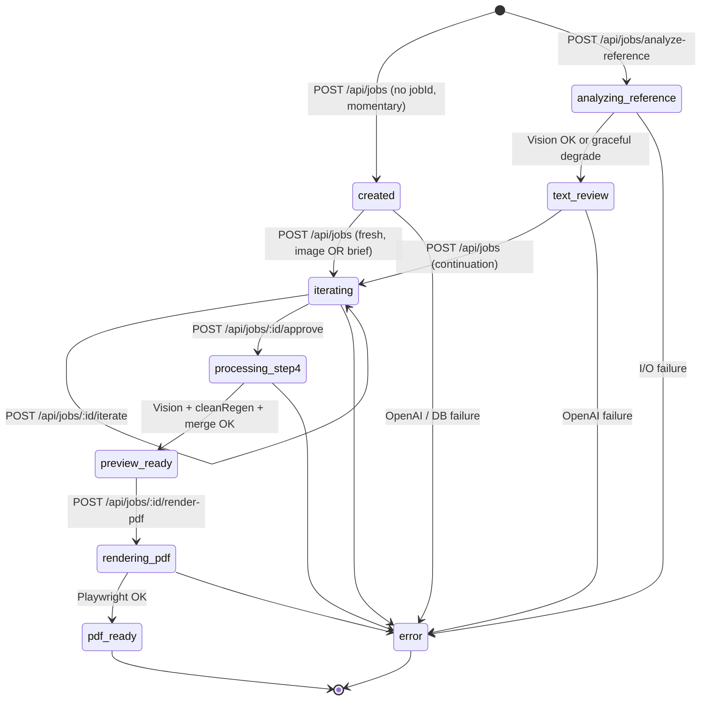
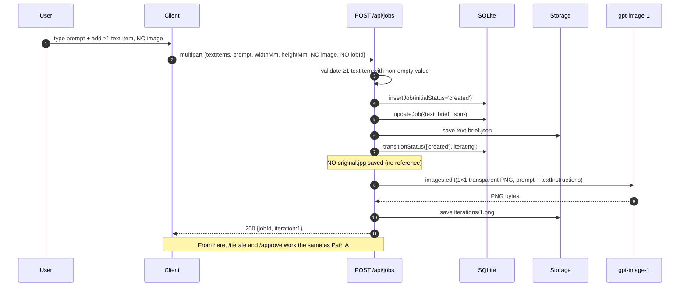
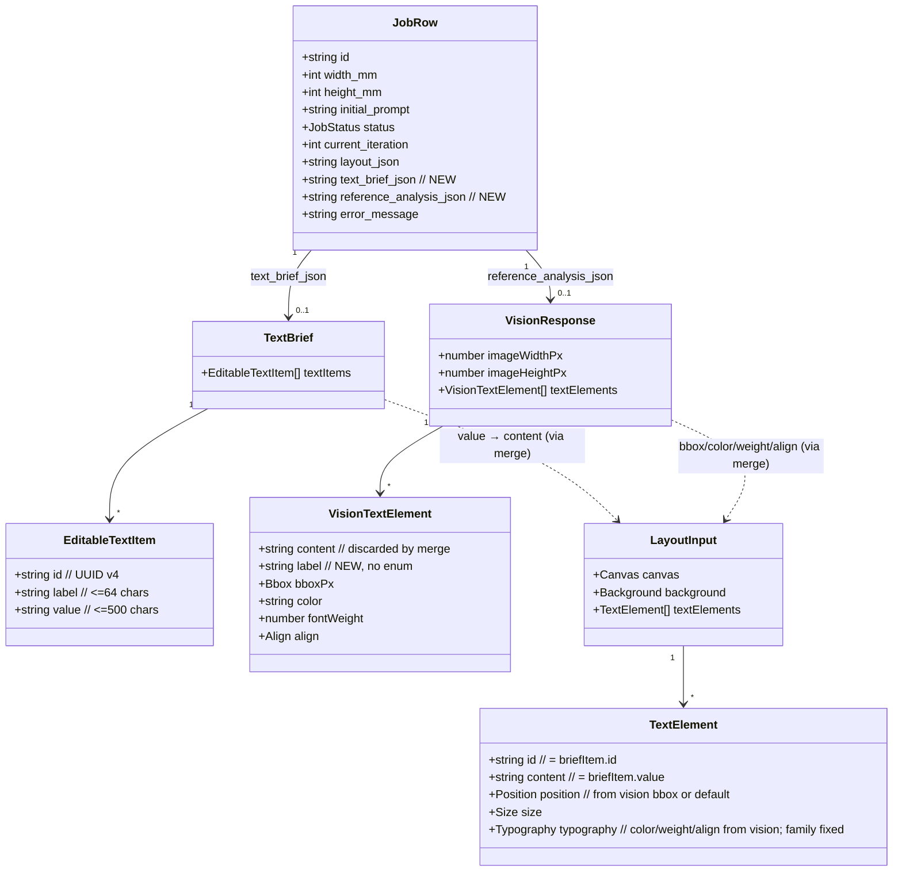

# Design Document — initial-text-brief-flow

## Overview

This feature inserts a new **Stage 0** (text brief setup) at the beginning of the AI Print Art MVP 1 pipeline. Stage 0 makes the textual content of every job an **explicit, user-editable artifact** (the `TextBrief`) that lives end-to-end: it drives the gpt-image-1 generation prompt at Stage 1/3, persists across iterations, and overrides the Vision OCR `content` field at Stage 4 when assembling the final `LayoutInput`.

Two entry paths are supported:

- **Path A — with reference image**: the user uploads `original.jpg`, the server runs gpt-4o Vision (`POST /api/jobs/analyze-reference`), produces a draft `TextBrief` ordered by reading order, and the client renders the `text_review` editor. The user reviews, then submits `POST /api/jobs` with `jobId` (continuation) to start generation.
- **Path B — without reference image**: the user types a prompt and at least one text item, then submits `POST /api/jobs` directly (no `jobId`). The server creates the job, generates with a 1×1 transparent PNG fallback to satisfy `images.edit`, and lands in `iterating`.

The existing approve endpoint still calls Vision on `approved.png` and still calls `regenerateWithoutText` in parallel, but the merge step now uses **brief.value** as the textual content (positions, color, weight, alignment continue to come from the Vision bbox). The Vision `content` field is discarded.

The PDF rendering pipeline (`renderLayoutHTML`, Inter Variable, Playwright, `final.pdf`) is **untouched** (Req 15.6, 15.7).

---

## Architecture

### Updated state machine



The two **new** states are `analyzing_reference` and `text_review` (satisfies Req 10.3, 10.4, 13.1). All `*  → error` edges are allowed by extending the existing convention; only the `from` arrays at each call site are updated (Req 13.5).

### Component diagram

```mermaid
graph TB
    subgraph Client[Browser - app/page.tsx]
        TS[text_setup sub-state]
        TR[text_review sub-state]
        IT[iterating sub-state]
        PV[preview / done / error]
        BE[Brief_Editor renderTextBriefEditor]
        SM[SettingsModal]
        TS --> TR
        TS --> IT
        TR --> IT
        IT --> PV
        TR -.uses.-> BE
        IT -.uses.-> BE
    end

    subgraph Server[Next.js Route Handlers]
        AR["POST /api/jobs/analyze-reference  NEW"]
        JC["POST /api/jobs  ALTERED"]
        JI["POST /api/jobs/:id/iterate  ALTERED"]
        JA["POST /api/jobs/:id/approve  ALTERED"]
        JS["GET /api/jobs/:id/status  unchanged"]
        JIt["GET /api/jobs/:id/iterations/:n  unchanged"]
        JPh["GET /api/jobs/:id/preview-html  unchanged"]
        JR["POST /api/jobs/:id/render-pdf  unchanged"]
        JP["GET /api/jobs/:id/pdf  unchanged"]
        PR["GET/PUT /api/prompts  unchanged"]
    end

    subgraph Lib[Shared modules]
        OAI[lib/openai.ts]
        VR[lib/openai/visionRetry.ts]
        PR2[lib/prompts.ts + formatTextInstructions NEW]
        NORM[lib/layout/normalize.ts + sortByReadingOrder + mergeBriefWithVisionLayout NEW]
        REND[lib/layout/render.ts unchanged]
        TYP[lib/layout/types.ts + JobStatus EXTENDED + TextBrief NEW]
        DB[lib/db.ts EXTENDED]
        ST[lib/storage.ts unchanged]
    end

    subgraph OpenAI[OpenAI API]
        V[gpt-4o Vision]
        I[gpt-image-1 images.edit]
    end

    Client -->|multipart| AR
    Client -->|multipart| JC
    Client -->|multipart| JI
    Client --> JA
    Client -.poll.-> JS
    Client --> SM --> PR

    AR --> VR --> OAI --> V
    AR --> DB
    AR --> ST
    AR --> NORM

    JC --> OAI --> I
    JC --> DB
    JC --> ST
    JC --> PR2

    JI --> OAI
    JI --> DB
    JI --> ST
    JI --> PR2

    JA --> VR
    JA --> OAI
    JA --> DB
    JA --> ST
    JA --> NORM

    REND -.consumed by.-> JPh
    REND -.consumed by.-> JR
```



(satisfies Req 1, Req 2, Req 5, Req 6, Req 8, Req 9, Req 10, Req 11)

### Sequence diagram — Path A (with reference image)

```mermaid
sequenceDiagram
    autonumber
    participant U as User
    participant C as Client (app/page.tsx)
    participant AR as POST /analyze-reference
    participant DB as SQLite
    participant FS as Storage
    participant V as gpt-4o Vision
    participant JC as POST /api/jobs (continuation)
    participant I as gpt-image-1
    participant JI as POST /iterate
    participant JA as POST /approve
    participant JR as POST /render-pdf

    U->>C: select image, fill width/height/prompt
    C->>AR: multipart {image, widthMm, heightMm, prompt?}
    AR->>DB: insertJob(initialStatus='analyzing_reference')
    AR->>FS: save original.jpg
    AR->>V: extractLayoutVisionWithRetry(image, 1)
    alt Vision OK
        V-->>AR: VisionResponse (with label)
        AR->>FS: save reference-analysis.json
        AR->>AR: sortByReadingOrder → build TextBrief
        AR->>DB: updateJob({text_brief_json, reference_analysis_json})
        AR->>FS: save text-brief.json
        AR->>DB: transitionStatus(['analyzing_reference'],'text_review')
        AR-->>C: 200 {jobId, status:'text_review', textItems}
    else Vision failed after retry
        AR->>DB: updateJob({text_brief_json={textItems:[]}, reference_analysis_json=NULL})
        AR->>FS: save text-brief.json (empty)
        AR->>DB: transitionStatus(['analyzing_reference'],'text_review')
        AR-->>C: 200 {jobId, textItems:[], warning:'vision_unavailable'}
    end

    U->>C: edit textItems in Brief_Editor, click "Gerar arte"
    C->>JC: multipart {jobId, textItems, widthMm, heightMm, prompt, image?}
    JC->>DB: assert status='text_review'
    JC->>DB: updateJob({text_brief_json})
    JC->>FS: save text-brief.json
    JC->>DB: transitionStatus(['text_review'],'iterating')
    JC->>FS: read original.jpg (or overwrite if new image)
    JC->>I: images.edit(original.jpg, prompt + textInstructions)
    I-->>JC: PNG bytes
    JC->>FS: save iterations/1.png
    JC->>DB: updateJob({current_iteration:1})
    JC-->>C: 200 {jobId, iteration:1}

    loop while user refines
      U->>C: edit textItems + refine prompt
      C->>JI: multipart {prompt, textItems, image?}
      JI->>DB: updateJob({text_brief_json}) ; FS: save text-brief.json
      JI->>I: images.edit
      JI-->>C: 200 {iteration:n+1}
    end

    U->>C: Approve
    C->>JA: POST /approve
    JA->>JA: parallel(extractLayoutVisionWithRetry, regenerateWithoutText)
    JA->>JA: mergeBriefWithVisionLayout(brief, visionResponse, ...)
    JA->>FS: save layout.json + clean.png + vision.json
    JA->>DB: transition processing_step4 → preview_ready
    C->>JR: POST /render-pdf  → final.pdf
```

### Sequence diagram — Path B (no reference image)



### Data model diagram



The crucial relationship: `LayoutInput.textElements[i].content` always comes from `TextBrief.textItems[*].value`, **never** from `VisionResponse.textElements[*].content` (Req 8.7, P-BRIEF-2).

---

## Components and Interfaces

### a) `lib/layout/types.ts` — extended

```typescript
export type JobStatus =
  | 'created'
  | 'analyzing_reference'   // NEW (Req 10.4, 13.1)
  | 'text_review'           // NEW (Req 10.4, 13.1)
  | 'iterating'
  | 'processing_step4'
  | 'preview_ready'
  | 'rendering_pdf'
  | 'pdf_ready'
  | 'error';

// NEW (Req 12.7, glossary)
export type EditableTextItem = {
  id: string;     // UUID v4
  label: string;  // <= 64 chars, no enum
  value: string;  // <= 500 chars
};

// NEW
export type TextBrief = {
  textItems: EditableTextItem[];
};

// LayoutInput and TextElement are unchanged.
```

### b) `lib/layout/normalize.ts` — extended

Three additions, plus a Zod-schema extension. The existing `normalizeVisionResponse` is preserved (Req 8.10).

#### b.1) Zod schema extension (Req 2.2, 9.2, P-SCHEMA-1)

```typescript
export const VisionTextElementSchema = z.object({
  content: z.string().min(1),
  label: z.string(),  // NEW — no enum, accepts any string including ''
  bboxPx: z.object({
    x: z.number().nonnegative(),
    y: z.number().nonnegative(),
    width: z.number().positive(),
    height: z.number().positive(),
  }),
  color: z.string(),
  fontWeight: z.number().int().min(100).max(900),
  align: z.enum(['left', 'center', 'right']),
});
```

#### b.2) `sortByReadingOrder` (NEW, pure) (Req 2.4, 2.5, P-ORDER-1)

```typescript
export type VisionTextElement = z.infer<typeof VisionTextElementSchema>;

/**
 * Pure, deterministic, total order sort of vision text elements
 * by visual reading order: top-to-bottom (primary),
 * left-to-right (secondary, when y-overlap > 50% of max height).
 *
 * The comparator is implemented by computing the y-overlap fraction
 * between two boxes and using x as the tiebreaker when they're on
 * the "same row".
 */
export function sortByReadingOrder(
  elements: VisionTextElement[],
): VisionTextElement[] {
  // Stable copy then sort
  return [...elements].sort((a, b) => {
    const ay1 = a.bboxPx.y;
    const ay2 = a.bboxPx.y + a.bboxPx.height;
    const by1 = b.bboxPx.y;
    const by2 = b.bboxPx.y + b.bboxPx.height;

    // y-overlap = max(0, min(ay2, by2) - max(ay1, by1))
    const overlap = Math.max(0, Math.min(ay2, by2) - Math.max(ay1, by1));
    const maxH = Math.max(a.bboxPx.height, b.bboxPx.height);
    const sameRow = maxH > 0 && overlap / maxH > 0.5;

    if (sameRow) {
      if (a.bboxPx.x !== b.bboxPx.x) return a.bboxPx.x - b.bboxPx.x;
      // tie-breaker on tie: keep insertion order via y, then 0
      if (a.bboxPx.y !== b.bboxPx.y) return a.bboxPx.y - b.bboxPx.y;
      return 0;
    }

    // Different rows → sort by top edge
    if (a.bboxPx.y !== b.bboxPx.y) return a.bboxPx.y - b.bboxPx.y;
    // Same top edge but small heights → fallback to x
    return a.bboxPx.x - b.bboxPx.x;
  });
}
```

Notes:
- `Array.prototype.sort` in V8 is stable, so equal elements (under the comparator) keep insertion order — required for determinism.
- The "same row" rule applies only when both boxes have non-zero height; when `maxH === 0` we fall through to the y-comparison branch.
- The function is total: every pair of elements is comparable (no `NaN` from comparators because `bboxPx` fields are validated as finite non-negative numbers by the schema).

#### b.3) `mergeBriefWithVisionLayout` (NEW, pure) (Req 8.3–8.8, P-BRIEF-2, P-MATCH-1)

```typescript
export interface MergeArgs {
  brief: TextBrief;
  visionResponse: VisionResponse;
  imageWidthPx: number;
  imageHeightPx: number;
  canvasWidthMm: number;
  canvasHeightMm: number;
  backgroundDataUrl: string;
}

export function mergeBriefWithVisionLayout(args: MergeArgs): LayoutInput {
  const { brief, visionResponse, imageWidthPx, imageHeightPx,
          canvasWidthMm, canvasHeightMm, backgroundDataUrl } = args;

  // (1) Filter brief to non-empty values
  const effective = brief.textItems.filter(
    (t) => t.value.trim().length > 0,
  );

  // (2) Sort both lists by reading order
  const sortedVision = sortByReadingOrder(visionResponse.textElements);
  // Brief order is the user's typed order; we treat it as canonical.
  // If we had ordering metadata we'd sort it; but here index === user order.
  const sortedBrief = effective;

  const sx = canvasWidthMm / imageWidthPx;
  const sy = canvasHeightMm / imageHeightPx;
  const clamp = (v: number, lo: number, hi: number) => Math.min(Math.max(v, lo), hi);

  const matched = Math.min(sortedBrief.length, sortedVision.length);
  const matchedElements: TextElement[] = [];

  // (3) Match by index up to min length
  for (let i = 0; i < matched; i++) {
    const b = sortedBrief[i];
    const v = sortedVision[i];

    const xMm = clamp(v.bboxPx.x * sx, 0, canvasWidthMm);
    const yMm = clamp(v.bboxPx.y * sy, 0, canvasHeightMm);
    const widthMm = clamp(v.bboxPx.width * sx, 0, canvasWidthMm - xMm);
    const heightMm = clamp(v.bboxPx.height * sy, 0, canvasHeightMm - yMm);

    matchedElements.push({
      id: b.id,                 // (8) brief's id is canonical
      content: b.value,         // (7) value from brief — vision content discarded
      position: { xMm, yMm },
      size: { widthMm, heightMm },
      typography: {
        fontFamily: 'Inter, sans-serif',
        fontSizePx: estimateFontSizePx(v.bboxPx.height, b.value),
        fontWeight: v.fontWeight,
        color: v.color,
        align: v.align,
      },
    });
  }

  // (4) Extra brief items get default positioning (Req 8.5)
  // Stacked vertically, centred horizontally, starting near canvas centre,
  // with a fixed gap of 10mm and a default height of 20mm.
  const extraBrief = sortedBrief.slice(matched);
  const DEFAULT_HEIGHT_MM = 20;
  const DEFAULT_GAP_MM = 10;
  const DEFAULT_FONT_PX = 24;
  const DEFAULT_WIDTH_MM = canvasWidthMm * 0.8;
  const stackStartY = canvasHeightMm / 2;

  extraBrief.forEach((b, k) => {
    const yMm = clamp(
      stackStartY + k * (DEFAULT_HEIGHT_MM + DEFAULT_GAP_MM),
      0,
      Math.max(0, canvasHeightMm - DEFAULT_HEIGHT_MM),
    );
    const widthMm = Math.min(DEFAULT_WIDTH_MM, canvasWidthMm);
    const xMm = clamp((canvasWidthMm - widthMm) / 2, 0, canvasWidthMm);
    const heightMm = Math.min(DEFAULT_HEIGHT_MM, canvasHeightMm - yMm);

    matchedElements.push({
      id: b.id,
      content: b.value,
      position: { xMm, yMm },
      size: { widthMm, heightMm },
      typography: {
        fontFamily: 'Inter, sans-serif',
        fontSizePx: DEFAULT_FONT_PX,
        fontWeight: 400,
        color: '#000000',
        align: 'center',
      },
    });
  });

  // (5) Extra vision elements (sortedVision.length > sortedBrief.length) are dropped.

  return {
    canvas: { widthMm: canvasWidthMm, heightMm: canvasHeightMm },
    background: { dataUrl: backgroundDataUrl },
    textElements: matchedElements,
  };
}
```

Properties guaranteed by construction:
- `merged.textElements.length === Math.min(b, v) + max(0, b - v) === Math.max(b, min(b,v))` — i.e., always equal to `effectiveBrief.length` when `b ≥ v`, and to `v + (b - v)` when same — but **dropping** vision excess (Req 8.6, P-MATCH-1).
- For every element in the result, `content` came from a brief item with non-empty `value` (P-BRIEF-2).
- Result is independent of OS / locale (no `Intl.Collator`, no string compares).

### c) `lib/db.ts` — extended (Req 10)

#### c.1) Schema (initSchema)

```sql
CREATE TABLE IF NOT EXISTS jobs (
  id TEXT PRIMARY KEY,
  width_mm INTEGER NOT NULL,
  height_mm INTEGER NOT NULL,
  initial_prompt TEXT NOT NULL,
  status TEXT NOT NULL CHECK (status IN (
    'created','analyzing_reference','text_review','iterating',
    'processing_step4','preview_ready','rendering_pdf','pdf_ready','error'
  )),  -- (Req 10.3)
  current_iteration INTEGER NOT NULL DEFAULT 0,
  layout_json TEXT,
  text_brief_json TEXT,            -- NEW (Req 10.1)
  reference_analysis_json TEXT,    -- NEW (Req 10.2)
  error_message TEXT,
  created_at INTEGER NOT NULL,
  updated_at INTEGER NOT NULL
);
```

#### c.2) Type extensions

```typescript
export type JobRow = {
  id: string;
  width_mm: number;
  height_mm: number;
  initial_prompt: string;
  status: JobStatus;
  current_iteration: number;
  layout_json: string | null;
  text_brief_json: string | null;            // NEW (Req 10.5)
  reference_analysis_json: string | null;    // NEW (Req 10.5)
  error_message: string | null;
  created_at: number;
  updated_at: number;
};
```

#### c.3) `insertJob` accepts optional `initialStatus` (Req 10.7)

```typescript
export function insertJob(input: {
  id: string;
  widthMm: number;
  heightMm: number;
  initialPrompt: string;
  initialStatus?: JobStatus;  // NEW; defaults to 'created'
}): void {
  const status = input.initialStatus ?? 'created';
  // INSERT INTO jobs (..., status, ...) VALUES (..., status, ...)
}
```

#### c.4) `updateJob` accepts new patchable fields (Req 10.6)

```typescript
export function updateJob(
  id: string,
  patch: Partial<Pick<JobRow,
    'current_iteration' |
    'layout_json' |
    'text_brief_json' |               // NEW
    'reference_analysis_json' |       // NEW
    'error_message'
  >>,
): void { /* same builder; just extend the allowed list */ }
```

#### c.5) NEW thin wrappers (Req 11.5, P-PERSISTENCE-PARITY-1)

```typescript
import { localStorage } from './storage';

export function getTextBrief(id: string): TextBrief | null {
  const job = getJob(id);
  if (!job?.text_brief_json) return null;
  return JSON.parse(job.text_brief_json) as TextBrief;
}

/**
 * Convenience wrapper: writes the brief to BOTH the DB column AND the
 * filesystem (text-brief.json). The DB write is the source of truth;
 * if the file write throws AFTER the DB write succeeds, the error is
 * logged and swallowed (drift accepted per Req 11.5).
 */
export async function setTextBrief(
  id: string,
  brief: TextBrief,
): Promise<void> {
  updateJob(id, { text_brief_json: JSON.stringify(brief) });
  try {
    await localStorage.saveJson(id, 'text-brief.json', brief);
  } catch (err) {
    console.warn(`[setTextBrief] FS drift for job ${id}:`, err);
  }
}
```

The wrappers make sure every code path that updates the brief writes to both stores in the same order — DB first (atomic), then file (best-effort). This guarantees property P-PERSISTENCE-PARITY-1 on the happy path.

### d) `lib/prompts.ts` — extended (Req 9)

#### d.1) New default `imageGeneration` template (Req 9.1)

```text
{{userPrompt}}

Physical dimensions: {{widthMm}}mm × {{heightMm}}mm. Generate a high-quality image suitable for large-format printing at these dimensions.

{{textInstructions}}
```

#### d.2) New default `visionLayout` template (Req 9.2, 9.3)

```text
You are a precise layout analysis assistant.
Analyze the provided image and extract all visible text elements with their exact positions and styling.
Return ONLY a valid JSON object matching this exact schema — no markdown, no explanation:

{
  "imageWidthPx": <number — width of the image in pixels>,
  "imageHeightPx": <number — height of the image in pixels>,
  "textElements": [
    {
      "content": "<exact text content, preserve newlines as \\n>",
      "label": "<short hierarchy hint, e.g. 'titulo', 'subtitulo', 'preco', 'descricao', 'rodape'; any string is acceptable>",
      "bboxPx": {
        "x": <number — left edge in pixels, >= 0>,
        "y": <number — top edge in pixels, >= 0>,
        "width": <number — width in pixels, > 0>,
        "height": <number — height in pixels, > 0>
      },
      "color": "<CSS color string, e.g. '#FFFFFF' or 'white'>",
      "fontWeight": <integer multiple of 100 between 100 and 900>,
      "align": "<'left' | 'center' | 'right'>"
    }
  ]
}

Return elements ordered top-to-bottom (primary) and left-to-right (secondary when y-overlap exceeds 50% of the larger element height).
```

#### d.3) Updated `PROMPT_DEFINITIONS` (Req 9.9)

```typescript
{
  id: 'imageGeneration',
  variables: [
    { name: 'userPrompt',  description: '...', example: '...' },
    { name: 'widthMm',     description: '...', example: '300' },
    { name: 'heightMm',    description: '...', example: '500' },
    { name: 'textInstructions',  // NEW
      description: 'Bloco de instruções textuais geradas a partir do TextBrief; lista cada item ou instrui a ausência total de texto',
      example: 'Include EXACTLY these texts...\n- titulo: "PROMOÇÃO"\n- preco: "R$ 19,90"' },
  ],
  template: DEFAULT_PROMPTS.imageGeneration,
}
```

#### d.4) NEW pure function `formatTextInstructions` (Req 9.4–9.7, P-DETERMINISM-1)

```typescript
import type { EditableTextItem } from './layout/types';

/**
 * Pure, deterministic, server-side. Maps an effective brief
 * (already filtered to non-empty values by the caller) into a
 * single block of instructions for gpt-image-1.
 *
 * Empty input → "no text" instruction.
 * Non-empty   → enumerated list with mandatory header.
 *
 * Determinism: order of items is preserved as given; no Date/random/locale.
 */
export function formatTextInstructions(
  textItems: EditableTextItem[],
): string {
  if (textItems.length === 0) {
    return 'Generate a 100% text-free image: no letters, numbers, words, watermarks, or typographic elements anywhere.';
  }

  const lines = textItems
    .map((t) => `- ${t.label}: "${t.value}"`)
    .join('\n');

  return [
    'Include EXACTLY these texts in the image, with no spelling, number or punctuation changes. Do not invent extra texts. Do not omit any. Use the labels as visual hierarchy hints but do not render the labels themselves.',
    lines,
  ].join('\n');
}
```

Exact byte outputs:

- **Empty list**: a single line, no trailing newline:
  `Generate a 100% text-free image: no letters, numbers, words, watermarks, or typographic elements anywhere.`

- **Non-empty list**: header line, `\n`, then `\n`-joined items:
  ```
  Include EXACTLY these texts in the image, with no spelling, number or punctuation changes. Do not invent extra texts. Do not omit any. Use the labels as visual hierarchy hints but do not render the labels themselves.
  - titulo: "PROMOÇÃO"
  - preco: "R$ 19,90"
  ```

#### d.5) `loadPrompts()` fallback behaviour (Req 9.1)

The existing `loadPrompts` already does a per-key merge with `DEFAULT_PROMPTS`. Adding `{{textInstructions}}` to the **default** template means:
- Brand-new installs: get the new default automatically.
- Installs with an existing `storage/prompts.json` saved through the UI: keep their custom `imageGeneration` text. Their custom template will not contain `{{textInstructions}}`, so `interpolate(...)` simply does not inject the brief block — image generation continues to work, but the user is expected to add `{{textInstructions}}` to their template via the Settings UI when they want the new behaviour.
- The Settings UI lists `textInstructions` among the available variables for `imageGeneration` (Req 9.9), giving the user a discoverable hint.

This is a graceful, backward-compatible transition with no migration logic on the prompts file.

### e) `lib/openai/visionRetry.ts` — UNCHANGED

The function `extractLayoutVisionWithRetry(image, maxRetries=1)` is reused as-is by Stage 0 (Req 2.1) and by Stage 4 (existing behaviour, Req 8.2). No new code path here.

### f) `app/api/jobs/analyze-reference/route.ts` — NEW (Req 1, Req 2, Req 14)

```typescript
import { NextRequest, NextResponse } from 'next/server';
import { z } from 'zod';
import { insertJob, updateJob, transitionStatus } from '@/lib/db';
import { localStorage } from '@/lib/storage';
import { extractLayoutVisionWithRetry } from '@/lib/openai/visionRetry';
import { sortByReadingOrder } from '@/lib/layout/normalize';
import type { TextBrief, EditableTextItem } from '@/lib/layout/types';

const RequestSchema = z.object({
  widthMm: z.coerce.number().int().positive(),
  heightMm: z.coerce.number().int().positive(),
  prompt: z.string().optional().default(''),
});

const MAX_IMAGE_SIZE = 10 * 1024 * 1024;

export async function POST(req: NextRequest): Promise<NextResponse> {
  let jobId: string | null = null;
  try {
    const formData = await req.formData();

    // 1) Validate image (Req 1.4, 1.5)
    const imageFile = formData.get('image');
    if (!imageFile || !(imageFile instanceof File) || imageFile.size === 0) {
      return NextResponse.json({ error: 'Missing or invalid image field' }, { status: 400 });
    }
    if (imageFile.size > MAX_IMAGE_SIZE) {
      return NextResponse.json({ error: 'Image exceeds maximum size of 10 MB' }, { status: 400 });
    }

    // 2) Validate other fields (Req 1.6)
    const parsed = RequestSchema.safeParse({
      widthMm: formData.get('widthMm'),
      heightMm: formData.get('heightMm'),
      prompt: formData.get('prompt') ?? '',
    });
    if (!parsed.success) {
      return NextResponse.json({ error: 'Validation failed', details: parsed.error.flatten() }, { status: 400 });
    }
    const { widthMm, heightMm, prompt } = parsed.data;

    // 3) Create job at status 'analyzing_reference' (Req 1.2, 13.3)
    jobId = crypto.randomUUID();
    insertJob({
      id: jobId,
      widthMm,
      heightMm,
      initialPrompt: prompt,
      initialStatus: 'analyzing_reference',
    });

    // 4) Save original.jpg BEFORE Vision (Req 1.3)
    const imageBuffer = Buffer.from(await imageFile.arrayBuffer());
    await localStorage.saveBytes(jobId, 'original.jpg', imageBuffer);

    // 5) Vision call (Req 2.1)
    let visionResponse: Awaited<ReturnType<typeof extractLayoutVisionWithRetry>> | null = null;
    try {
      visionResponse = await extractLayoutVisionWithRetry(imageBuffer, 1);
    } catch (visionErr) {
      // Graceful degradation (Req 1.12, 14.1, 14.2, 14.4)
      console.warn(`[analyze-reference ${jobId}] vision failed, degrading:`, visionErr);
      const emptyBrief: TextBrief = { textItems: [] };
      updateJob(jobId, {
        text_brief_json: JSON.stringify(emptyBrief),
        reference_analysis_json: null,
      });
      await localStorage.saveJson(jobId, 'text-brief.json', emptyBrief);
      const ok = transitionStatus(jobId, ['analyzing_reference'], 'text_review');
      if (!ok) throw new Error('Failed to transition to text_review (graceful path)');
      return NextResponse.json(
        { jobId, status: 'text_review', textItems: [], warning: 'vision_unavailable' },
        { status: 200 },
      );
    }

    // 6) Persist reference analysis (Req 1.7)
    await localStorage.saveJson(jobId, 'reference-analysis.json', visionResponse);

    // 7) Sort by reading order defensively (Req 2.4) and build TextBrief (Req 1.8)
    const sorted = sortByReadingOrder(visionResponse.textElements);
    const textItems: EditableTextItem[] = sorted.map((v) => ({
      id: crypto.randomUUID(),
      label: v.label,
      value: v.content,
    }));
    const brief: TextBrief = { textItems };

    // 8) Persist brief (Req 1.9, 11.2)
    updateJob(jobId, {
      text_brief_json: JSON.stringify(brief),
      reference_analysis_json: JSON.stringify(visionResponse),
    });
    await localStorage.saveJson(jobId, 'text-brief.json', brief);

    // 9) Transition (Req 1.10)
    const ok = transitionStatus(jobId, ['analyzing_reference'], 'text_review');
    if (!ok) throw new Error('Failed to transition to text_review');

    // 10) Respond (Req 1.11)
    return NextResponse.json(
      { jobId, status: 'text_review', textItems },
      { status: 200 },
    );
  } catch (err) {
    // Non-Vision failure path (Req 1.14, 14.3)
    if (jobId) {
      try {
        updateJob(jobId, { error_message: String(err) });
        transitionStatus(jobId, ['analyzing_reference'], 'error');
      } catch { /* best-effort */ }
    }
    console.error('[POST /api/jobs/analyze-reference]', err);
    return NextResponse.json({ error: 'Internal server error' }, { status: 500 });
  }
}
```

**Response shapes** (Req 1.11, 1.12, 1.14):

```jsonc
// Success (Vision OK)
{ "jobId": "uuid", "status": "text_review", "textItems": [{ "id": "uuid", "label": "titulo", "value": "PROMOÇÃO" }] }

// Graceful degradation (Vision failed after retry)
{ "jobId": "uuid", "status": "text_review", "textItems": [], "warning": "vision_unavailable" }

// Error (validation, oversized, or I/O failure)
{ "error": "Internal server error" }              // 500 for I/O failures
{ "error": "Missing or invalid image field" }     // 400
{ "error": "Image exceeds maximum size of 10 MB" }// 400
{ "error": "Validation failed", "details": {...}}// 400
```

The endpoint is **synchronous**: every code path resolves only after the final `text_review` (or `error`) transition (Req 1.13).

### g) `app/api/jobs/route.ts` — ALTERED (Req 5)

```typescript
import { NextRequest, NextResponse } from 'next/server';
import { z } from 'zod';
import { getJob, insertJob, transitionStatus, updateJob, setTextBrief } from '@/lib/db';
import { localStorage } from '@/lib/storage';
import { generateImageToImage } from '@/lib/openai';
import type { TextBrief, EditableTextItem } from '@/lib/layout/types';

// 1×1 transparent PNG fallback (base64) — see "rationale" note below.
const TRANSPARENT_PNG_1X1_BASE64 =
  'iVBORw0KGgoAAAANSUhEUgAAAAEAAAABCAQAAAC1HAwCAAAAC0lEQVR42mNk+A8AAQUBAScY42YAAAAASUVORK5CYII=';
const TRANSPARENT_PNG_1X1 = Buffer.from(TRANSPARENT_PNG_1X1_BASE64, 'base64');

const EditableTextItemSchema = z.object({
  id: z.string().uuid(),
  label: z.string().max(64),
  value: z.string().max(500),
});

const RequestSchema = z.object({
  jobId: z.string().uuid().optional(),
  widthMm: z.coerce.number().int().positive(),
  heightMm: z.coerce.number().int().positive(),
  prompt: z.string().min(1),
  textItems: z.array(EditableTextItemSchema),  // no max length — Req 5.4, 12.4
});

const MAX_IMAGE_SIZE = 10 * 1024 * 1024;

export async function POST(req: NextRequest): Promise<NextResponse> {
  let jobId: string | null = null;
  let isContinuation = false;

  try {
    const formData = await req.formData();

    // Parse textItems JSON (Req 5.3)
    const rawTextItems = formData.get('textItems');
    if (typeof rawTextItems !== 'string') {
      return NextResponse.json({ error: 'textItems is required (JSON array)' }, { status: 400 });
    }
    let parsedTextItems: unknown;
    try { parsedTextItems = JSON.parse(rawTextItems); }
    catch { return NextResponse.json({ error: 'textItems is not valid JSON' }, { status: 400 }); }

    const parsed = RequestSchema.safeParse({
      jobId: formData.get('jobId') || undefined,
      widthMm: formData.get('widthMm'),
      heightMm: formData.get('heightMm'),
      prompt: formData.get('prompt'),
      textItems: parsedTextItems,
    });
    if (!parsed.success) {
      return NextResponse.json({ error: 'Validation failed', details: parsed.error.flatten() }, { status: 400 });
    }
    const { jobId: jobIdFromBody, widthMm, heightMm, prompt, textItems } = parsed.data;
    isContinuation = !!jobIdFromBody;

    // Optional image (Req 5.1)
    const imageFile = formData.get('image');
    let uploadedImage: Buffer | null = null;
    if (imageFile instanceof File && imageFile.size > 0) {
      if (imageFile.size > MAX_IMAGE_SIZE) {
        return NextResponse.json({ error: 'Image exceeds maximum size of 10 MB' }, { status: 400 });
      }
      uploadedImage = Buffer.from(await imageFile.arrayBuffer());
    }

    // ─────────────────────────────────────────────────────────────────
    // Branch A: continuation — jobId provided
    // ─────────────────────────────────────────────────────────────────
    if (jobIdFromBody) {
      jobId = jobIdFromBody;
      const job = getJob(jobId);
      if (!job || job.status !== 'text_review') {
        return NextResponse.json(
          { error: 'Cannot start generation in current state' },
          { status: 409 },  // Req 5.7
        );
      }

      // Persist brief (Req 5.6, 11.2)
      await setTextBrief(jobId, { textItems });

      // Optionally overwrite original.jpg (Req 5.12)
      if (uploadedImage) {
        await localStorage.saveBytes(jobId, 'original.jpg', uploadedImage);
      }

      // Transition text_review → iterating (Req 5.6)
      const ok = transitionStatus(jobId, ['text_review'], 'iterating');
      if (!ok) {
        return NextResponse.json(
          { error: 'Cannot start generation in current state' },
          { status: 409 },
        );
      }

      // Read base image: uploaded if just provided, else previously saved original.jpg (Req 5.11, 5.12)
      const baseImage = uploadedImage ?? (await localStorage.readBytes(jobId, 'original.jpg'));

      const generated = await runGeneration({
        baseImage, prompt, widthMm, heightMm, textItems,
      });
      await localStorage.saveBytes(jobId, 'iterations/1.png', generated);
      updateJob(jobId, { current_iteration: 1 });

      return NextResponse.json({ jobId, iteration: 1 });
    }

    // ─────────────────────────────────────────────────────────────────
    // Branch B: fresh creation — no jobId
    // ─────────────────────────────────────────────────────────────────

    // Case B-without-image: enforce ≥1 non-empty textItem (Req 5.5, 12.2)
    const effectiveCount = textItems.filter((t) => t.value.trim().length > 0).length;
    if (!uploadedImage && effectiveCount === 0) {
      return NextResponse.json(
        { error: 'At least one non-empty text item is required when no reference image is provided' },
        { status: 400 },
      );
    }

    // Insert job at 'created' (momentary) — Req 5.8, 13.3
    jobId = crypto.randomUUID();
    insertJob({ id: jobId, widthMm, heightMm, initialPrompt: prompt /* default initialStatus='created' */ });

    // Save image only if provided (Req 5.9)
    if (uploadedImage) {
      await localStorage.saveBytes(jobId, 'original.jpg', uploadedImage);
    }

    // Persist brief (Req 5.8, 11.2)
    await setTextBrief(jobId, { textItems });

    // Transition created → iterating (Req 5.8)
    const ok = transitionStatus(jobId, ['created'], 'iterating');
    if (!ok) throw new Error('Failed to transition created → iterating');

    // Pick base image (Req 5.13)
    const baseImage = uploadedImage ?? TRANSPARENT_PNG_1X1;

    const generated = await runGeneration({
      baseImage, prompt, widthMm, heightMm, textItems,
    });
    await localStorage.saveBytes(jobId, 'iterations/1.png', generated);
    updateJob(jobId, { current_iteration: 1 });

    return NextResponse.json({ jobId, iteration: 1 });
  } catch (err) {
    if (jobId) {
      try {
        updateJob(jobId, { error_message: String(err) });
        transitionStatus(jobId, ['created', 'text_review', 'iterating'], 'error');
      } catch { /* best-effort */ }
    }
    console.error('[POST /api/jobs]', err);
    return NextResponse.json({ error: 'Internal server error' }, { status: 500 });
  }
}

async function runGeneration(args: {
  baseImage: Buffer;
  prompt: string;
  widthMm: number;
  heightMm: number;
  textItems: EditableTextItem[];
}): Promise<Buffer> {
  const effective = args.textItems.filter((t) => t.value.trim().length > 0);
  return generateImageToImage({
    baseImage: args.baseImage,
    prompt: args.prompt,
    widthMm: args.widthMm,
    heightMm: args.heightMm,
    textItems: effective,  // generateImageToImage extended — see (j) below
  });
}
```

#### The 1×1 transparent PNG fallback — rationale (Req 5.13)

`gpt-image-1` exposes two endpoints in the OpenAI Node SDK:

1. **`client.images.edit(...)`** — REQUIRES an `image` field (and optional `mask`). The current codebase uses this for both Stage 1 and Stage 3 (`generateImageToImage`).
2. **`client.images.generate(...)`** — pure text-to-image; no `image` argument allowed.

We considered switching to `images.generate` for the no-image case, but that requires:
- a separate code path with its own response handling,
- a separate prompt template (or careful conditional interpolation), and
- duplicated retry/error-translation logic.

We **chose** the 1×1 transparent PNG fallback because:
- It keeps **one** code path through `generateImageToImage`.
- The 1×1 transparent input behaves like a no-op base for the model — it has no semantic content to anchor on, so the model relies entirely on the prompt.
- The bytes are baked into a constant; no I/O at runtime.
- It is reversible: if we later add `images.generate` support, we can switch the no-image branch with no impact on the with-image branch.

The constant lives at the top of `app/api/jobs/route.ts`. The exact byte sequence is the well-known minimum-size transparent PNG (8-bit RGBA, single pixel, alpha=0, ~70 bytes).

### h) `app/api/jobs/[id]/iterate/route.ts` — ALTERED (Req 6)

Changes vs current:

1. Parse and validate `textItems` from multipart (same Zod as POST /api/jobs).
2. Persist brief BEFORE generation (Req 6.3) via `setTextBrief(id, { textItems })`.
3. Inject `formatTextInstructions(effectiveBrief)` into the prompt template (Req 6.4) — done by passing `textItems` down to `generateImageToImage`.
4. The endpoint NEVER calls Stage 0 Vision (Req 6.5).
5. The 409 guard for `status !== 'iterating'` is preserved (Req 6.7).

```typescript
// pseudocode (delta)
const formData = await req.formData();
const prompt = String(formData.get('prompt') ?? '').trim();
if (!prompt) return NextResponse.json({ error: 'prompt is required' }, { status: 400 });

const rawTextItems = formData.get('textItems');
const parsedItems = TextItemsSchema.safeParse(JSON.parse(String(rawTextItems)));
if (!parsedItems.success) return NextResponse.json({ error: 'textItems invalid', details: parsedItems.error.flatten() }, { status: 400 });

const job = getJob(id);
if (!job) return NextResponse.json({ error: 'Job not found' }, { status: 404 });
if (job.status !== 'iterating') return NextResponse.json({ error: 'Job is not in iterating state' }, { status: 409 });

await setTextBrief(id, { textItems: parsedItems.data });   // Req 6.3 — BEFORE generation

let baseImage: Buffer;
const imageFile = formData.get('image');
if (imageFile instanceof File && imageFile.size > 0) {
  baseImage = Buffer.from(await imageFile.arrayBuffer());
} else {
  baseImage = await localStorage.readBytes(id, `iterations/${job.current_iteration}.png`);
}

const next = job.current_iteration + 1;
const effective = parsedItems.data.filter((t) => t.value.trim().length > 0);
const generated = await generateImageToImage({
  baseImage, prompt, widthMm: job.width_mm, heightMm: job.height_mm,
  textItems: effective,
});
await localStorage.saveBytes(id, `iterations/${next}.png`, generated);
updateJob(id, { current_iteration: next });
return NextResponse.json({ iteration: next });
```

### i) `app/api/jobs/[id]/approve/route.ts` — ALTERED (Req 8)

Inside `runStage4`, after Vision + clean regen complete in parallel, swap `normalizeVisionResponse(...)` for `mergeBriefWithVisionLayout(...)`:

```typescript
async function runStage4(id: string, job: JobRow): Promise<void> {
  const approved = await localStorage.readBytes(id, `iterations/${job.current_iteration}.png`);
  await localStorage.saveBytes(id, 'approved.png', approved);

  // Parallel — unchanged (Req 8.2)
  const [rawVision, cleanPng] = await Promise.all([
    extractLayoutVisionWithRetry(approved, 1),
    regenerateWithoutText({ baseImage: approved, originalPrompt: job.initial_prompt }),
  ]);
  await localStorage.saveJson(id, 'vision.json', rawVision);
  await localStorage.saveBytes(id, 'clean.png', cleanPng);

  // Load brief from DB (Req 8.4)
  const brief = getTextBrief(id) ?? { textItems: [] };

  const cleanDataUrl = `data:image/png;base64,${cleanPng.toString('base64')}`;

  // NEW: merge instead of normalize (Req 8.3)
  const layoutInput = mergeBriefWithVisionLayout({
    brief,
    visionResponse: rawVision,
    imageWidthPx: rawVision.imageWidthPx,
    imageHeightPx: rawVision.imageHeightPx,
    canvasWidthMm: job.width_mm,
    canvasHeightMm: job.height_mm,
    backgroundDataUrl: cleanDataUrl,
  });

  // Persistence — unchanged (Req 8.9)
  const persisted = { ...layoutInput, background: { dataUrl: '__deferred__' } };
  await localStorage.saveJson(id, 'layout.json', persisted);
  updateJob(id, { layout_json: JSON.stringify(persisted) });

  const ok = transitionStatus(id, ['processing_step4'], 'preview_ready');
  if (!ok) throw new Error('Failed to transition to preview_ready');
}
```

`normalizeVisionResponse` is no longer invoked by approve (Req 8.10) but is kept exported for backward compatibility and reuse by tests.

### j) Frontend `app/page.tsx` — extended

#### j.1) Updated `AppState` union (Req 3, 4, 7)

```typescript
type AppState =
  | { step: 'text_setup' }                                      // RENAMED from 'idle'
  | { step: 'text_review'; jobId: string;                       // NEW
        widthMm: number; heightMm: number; warning?: 'vision_unavailable' }
  | { step: 'iterating'; jobId: string; currentIteration: number;
        widthMm: number; heightMm: number }
  | { step: 'awaiting_preview'; jobId: string; currentIteration: number;
        widthMm: number; heightMm: number }
  | { step: 'preview'; jobId: string; widthMm: number; heightMm: number }
  | { step: 'rendering_pdf'; jobId: string; widthMm: number; heightMm: number }
  | { step: 'done'; jobId: string }
  | { step: 'error'; errorMessage: string };
```

`text_setup` and `text_review` are explicit screens; the previous `idle` screen merges into `text_setup`. Both screens share the same form state at the top of the component:

```typescript
const [imageFile, setImageFile] = useState<File | null>(null);
const [widthMm, setWidthMm] = useState('');
const [heightMm, setHeightMm] = useState('');
const [prompt, setPrompt] = useState('');
const [textItems, setTextItems] = useState<EditableTextItem[]>([]);
// jobId is derived from state.step === 'text_review' | 'iterating' | …
```

#### j.2) `handleAnalyzeReference` (Req 3.5–3.8)

```typescript
async function handleAnalyzeReference() {
  if (!imageFile) return;
  // basic client-side validation of widthMm/heightMm (same as today)
  setLoading(true); setError(null);
  try {
    const compressed = await imageCompression(imageFile, COMPRESSION_OPTIONS);
    const fd = new FormData();
    fd.append('image', compressed, 'image.jpg');
    fd.append('widthMm', String(parseInt(widthMm, 10)));
    fd.append('heightMm', String(parseInt(heightMm, 10)));
    if (prompt) fd.append('prompt', prompt);

    const res = await fetch('/api/jobs/analyze-reference', { method: 'POST', body: fd });
    const data = (await res.json()) as
      | { jobId: string; status: 'text_review'; textItems: EditableTextItem[]; warning?: 'vision_unavailable' }
      | { error: string };
    if (!res.ok || 'error' in data) { setError('error' in data ? data.error : 'Analyze failed'); return; }

    setTextItems(data.textItems);
    setState({
      step: 'text_review', jobId: data.jobId,
      widthMm: parseInt(widthMm, 10), heightMm: parseInt(heightMm, 10),
      warning: data.warning,
    });
  } finally { setLoading(false); }
}
```

#### j.3) `handleSubmitInitial` — branches on jobId (Req 5)

```typescript
async function handleSubmitInitial(e: React.FormEvent) {
  e.preventDefault();
  // client-side validation:
  // - widthMm/heightMm > 0
  // - prompt non-empty
  // - if no image and no jobId → at least one non-empty textItem (Req 12.3, 3.3)
  setLoading(true); setError(null);
  try {
    const fd = new FormData();
    fd.append('widthMm', String(parseInt(widthMm, 10)));
    fd.append('heightMm', String(parseInt(heightMm, 10)));
    fd.append('prompt', prompt);
    fd.append('textItems', JSON.stringify(textItems));

    if (state.step === 'text_review') fd.append('jobId', state.jobId);
    if (imageFile) {
      const compressed = await imageCompression(imageFile, COMPRESSION_OPTIONS);
      fd.append('image', compressed, 'image.jpg');
    }

    const res = await fetch('/api/jobs', { method: 'POST', body: fd });
    const data = (await res.json()) as { jobId?: string; iteration?: number; error?: string };
    if (!res.ok || !data.jobId) { setError(data.error ?? 'Failed'); return; }

    setState({
      step: 'iterating', jobId: data.jobId, currentIteration: data.iteration!,
      widthMm: parseInt(widthMm, 10), heightMm: parseInt(heightMm, 10),
    });
  } finally { setLoading(false); }
}
```

#### j.4) `handleIterate` (Req 6, 7.2)

```typescript
async function handleIterate(e: React.FormEvent) {
  e.preventDefault();
  if (state.step !== 'iterating') return;
  setLoading(true); setError(null);
  try {
    const fd = new FormData();
    fd.append('prompt', iteratePrompt);
    fd.append('textItems', JSON.stringify(textItems));   // NEW (Req 7.2)
    if (iterateImage) {
      const compressed = await imageCompression(iterateImage, COMPRESSION_OPTIONS);
      fd.append('image', compressed, 'image.jpg');
    }
    const res = await fetch(`/api/jobs/${state.jobId}/iterate`, { method: 'POST', body: fd });
    const data = (await res.json()) as { iteration?: number; error?: string };
    if (!res.ok || data.iteration == null) { setError(data.error ?? 'Iteration failed'); return; }
    setState({ ...state, currentIteration: data.iteration });
    setIteratePrompt('');
    setIterateImage(null);
  } finally { setLoading(false); }
}
```

#### j.5) `renderTextBriefEditor` (Req 4.1–4.12, Req 7.1, 7.3)

Pseudocode:

```typescript
function renderTextBriefEditor() {
  return (
    <div>
      {textItems.map((item, idx) => (
        <div key={item.id} style={{ display:'flex', gap:8, alignItems:'center' }}>
          <input
            placeholder="label"
            value={item.label}
            maxLength={64}
            onChange={(e) => updateItem(item.id, { label: e.target.value })}
          />
          <input
            placeholder="value"
            value={item.value}
            maxLength={500}
            onChange={(e) => updateItem(item.id, { value: e.target.value })}
          />
          {item.value.trim().length === 0 && (
            <span style={{ background:'#fef3c7', color:'#92400e', padding:'2px 6px', borderRadius:4, fontSize:12 }}>
              este item será ignorado
            </span>
          )}
          <button onClick={() => removeItem(item.id)}>Remover</button>
        </div>
      ))}
      <button onClick={addItem}>+ Adicionar texto</button>  {/* never disabled — Req 4.12 */}
    </div>
  );

  function addItem() {
    setTextItems([...textItems, { id: crypto.randomUUID(), label: '', value: '' }]);
  }
  function removeItem(id: string) {
    setTextItems(textItems.filter((t) => t.id !== id));
  }
  function updateItem(id: string, patch: Partial<EditableTextItem>) {
    setTextItems(textItems.map((t) => t.id === id ? { ...t, ...patch } : t));
  }
}
```

#### j.6) Disabled-button rules (Req 3.3, 3.4, 4.10, 4.11)

```typescript
// "Analisar imagem" button (text_setup only)
const showAnalyzeBtn = state.step === 'text_setup' && !!imageFile;
const analyzeDisabled = loading || !widthMm || !heightMm;

// "Gerar arte" button
function generateDisabled(): { disabled: boolean; hint?: string } {
  if (loading) return { disabled: true };
  if (!widthMm || !heightMm) return { disabled: true, hint: 'Defina largura e altura' };
  if (!prompt.trim()) return { disabled: true, hint: 'Descreva o que gerar' };

  if (state.step === 'text_review') {
    return { disabled: false };  // (Req 4.10) — image present, brief can be empty
  }
  // text_setup
  const hasImage = !!imageFile;
  const hasNonEmpty = textItems.some((t) => t.value.trim().length > 0);
  if (!hasImage && !hasNonEmpty) {
    return { disabled: true, hint: 'Adicione ao menos um texto ou envie uma imagem de referência' };
  }
  return { disabled: false };
}
```

#### j.7) State persistence on file change (Req 3.9)

```typescript
function onImageFileChange(file: File | null) {
  setImageFile(file);
  // If we are in text_review and the user picks a different file,
  // discard the analysis result and return to text_setup.
  if (state.step === 'text_review') {
    setTextItems([]);
    setState({ step: 'text_setup' });
  }
}
```

`text_review` hides the "Analisar imagem" button (Req 4.5) and only exposes the editor + "Gerar arte" + "Trocar imagem".

### k) `lib/storage.ts` — UNCHANGED

The new files written by the new flow are listed below for documentation purposes only. No interface changes; both filenames are valid relative paths under `storage/jobs/{id}/`:

- `original.jpg` — saved by `analyze-reference` and by `POST /api/jobs` (continuation can overwrite).
- `text-brief.json` — written by `setTextBrief` after every successful brief update (`analyze-reference` success, `analyze-reference` graceful degrade, fresh creation, continuation, every iterate).
- `reference-analysis.json` — written by `analyze-reference` only on Vision success.

These are co-located in the per-job directory next to `iterations/`, `vision.json`, `layout.json`, `clean.png`, etc. (Req 11.1, 11.3, 11.4).

### l) `app/components/SettingsModal.tsx` — minor update

No structural change. The new variable is exposed automatically because the modal renders `def.variables` from `PROMPT_DEFINITIONS`. Updating that array (section d.3) is sufficient to make `{{textInstructions}}` appear under the `imageGeneration` card with its description and example (Req 9.9).

### m) `lib/openai.ts` — extended (small)

`generateImageToImage` accepts `textItems` so the prompt template can be interpolated with `{{textInstructions}}`:

```typescript
export async function generateImageToImage(args: {
  baseImage: Buffer;
  prompt: string;
  widthMm?: number;
  heightMm?: number;
  textItems?: EditableTextItem[];   // NEW
}): Promise<Buffer> {
  const prompts = loadPrompts();
  const finalPrompt = interpolate(prompts.imageGeneration, {
    userPrompt: args.prompt,
    widthMm: String(args.widthMm ?? ''),
    heightMm: String(args.heightMm ?? ''),
    textInstructions: formatTextInstructions(args.textItems ?? []),
  });
  // ... rest unchanged: client.images.edit(...)
}
```

`regenerateWithoutText` is unchanged (Req 9.8, 15.8).

---

## Data Models

### `EditableTextItem` (Zod) (Req 12.7)

```typescript
import { z } from 'zod';

export const EditableTextItemSchema = z.object({
  id: z.string().uuid(),                         // UUID v4 (z.string().uuid() accepts v1–v5; we additionally
                                                 // generate via crypto.randomUUID() which always emits v4)
  label: z.string().max(64),
  value: z.string().max(500),
});

export const TextBriefSchema = z.object({
  textItems: z.array(EditableTextItemSchema),    // no max length (Req 12.4)
});
```

Note: `z.string().uuid()` does not enforce v4 specifically. Server-side IDs are minted with `crypto.randomUUID()` (always v4). For ingress (continuation calls and iterate calls), we accept any RFC-4122 UUID — sufficient because the ID exists only as a stable handle in `LayoutInput.textElements[].id`.

### Updated `VisionTextElement` and `VisionResponse` (Req 9.2)

```typescript
export const VisionTextElementSchema = z.object({
  content: z.string().min(1),
  label: z.string(),                              // NEW
  bboxPx: z.object({
    x: z.number().nonnegative(),
    y: z.number().nonnegative(),
    width: z.number().positive(),
    height: z.number().positive(),
  }),
  color: z.string(),
  fontWeight: z.number().int().min(100).max(900),
  align: z.enum(['left', 'center', 'right']),
});

export const VisionResponseSchema = z.object({
  imageWidthPx: z.number().positive(),
  imageHeightPx: z.number().positive(),
  textElements: z.array(VisionTextElementSchema),
});
```

### `analyze-reference` JSON shapes

```jsonc
// 200 OK — Vision succeeded
{
  "jobId": "5b7b9d52-3f91-4f8c-9c2a-12d4e5f78901",
  "status": "text_review",
  "textItems": [
    { "id": "uuid-v4", "label": "titulo",    "value": "PROMOÇÃO" },
    { "id": "uuid-v4", "label": "subtitulo", "value": "Tudo com 50%" },
    { "id": "uuid-v4", "label": "preco",     "value": "R$ 19,90" }
  ]
}

// 200 OK — graceful degradation (Vision failed after retry)
{
  "jobId": "5b7b9d52-3f91-4f8c-9c2a-12d4e5f78901",
  "status": "text_review",
  "textItems": [],
  "warning": "vision_unavailable"
}

// 400 Bad Request — image issue
{ "error": "Missing or invalid image field" }
{ "error": "Image exceeds maximum size of 10 MB" }
{ "error": "Validation failed", "details": { /* Zod flatten() */ } }

// 500 Internal Server Error — non-Vision (I/O, DB) failure
{ "error": "Internal server error" }
```


---

## Correctness Properties

*A property is a characteristic or behavior that should hold true across all valid executions of a system — essentially, a formal statement about what the system should do. Properties serve as the bridge between human-readable specifications and machine-verifiable correctness guarantees.*

The properties below complement the requirements-document property catalog (P-BRIEF-1 through P-PERSISTENCE-PARITY-1). They consolidate facets that overlap (e.g., the merge function has many sub-claims that collapse into one structural-correctness property plus one sharper length-arithmetic property), and they map cleanly to the existing fast-check-based PBT setup in `tests/layout/`.

### Property 1: `sortByReadingOrder` produces a valid reading-order permutation

*For any* finite array `elements: VisionTextElement[]` (with valid finite non-negative bbox values), letting `result = sortByReadingOrder(elements)`:

1. `result.length === elements.length` and `result` is a permutation of `elements`.
2. For every pair of indices `i < j`, **either** `result[i]` is strictly above `result[j]` (the y-overlap fraction `(min(a.y2,b.y2) - max(a.y1,b.y1)) / max(a.h, b.h) ≤ 0.5`, with `a = result[i]`, `b = result[j]`) and `result[i].bboxPx.y ≤ result[j].bboxPx.y`, **or** the y-overlap fraction `> 0.5` and `result[i].bboxPx.x ≤ result[j].bboxPx.x`.
3. Calling `sortByReadingOrder(sortByReadingOrder(elements))` yields the same array (idempotent).

This property is the design-document realisation of **P-ORDER-1** from the requirements catalog.

**Validates: Requirements 2.4, 2.5**

### Property 2: TextBrief build from Vision is a sorted bijection

*For any* validated `VisionResponse v`, the TextBrief produced by Stage 0 satisfies:

1. `brief.textItems.length === v.textElements.length`.
2. For each `i`, `brief.textItems[i].label === sorted[i].label` and `brief.textItems[i].value === sorted[i].content` where `sorted = sortByReadingOrder(v.textElements)`.
3. Every `brief.textItems[i].id` is a syntactically valid UUID and the set of IDs has no duplicates within the brief.

**Validates: Requirements 1.8, 2.6**

### Property 3: `mergeBriefWithVisionLayout` structural correctness

*For any* `(brief: TextBrief, visionResponse: VisionResponse, canvas: {widthMm, heightMm}, image: {imageWidthPx, imageHeightPx})`, letting `merged = mergeBriefWithVisionLayout({brief, visionResponse, ...})` and `effective = brief.textItems.filter(t => t.value.trim().length > 0)` and `sortedV = sortByReadingOrder(visionResponse.textElements)`:

1. **Content origin**: for every element `e` in `merged.textElements`, there exists `b ∈ effective` such that `e.content === b.value` and `e.id === b.id`. *No element's `content` is ever taken from the vision response*.
2. **Style inheritance for matched indices**: for `0 ≤ i < min(effective.length, sortedV.length)`, `merged.textElements[i].typography.color === sortedV[i].color`, `merged.textElements[i].typography.fontWeight === sortedV[i].fontWeight`, `merged.textElements[i].typography.align === sortedV[i].align`, and the position/size derive from `sortedV[i].bboxPx` scaled by `canvasMm/imagePx` and clamped to the canvas.
3. **Bounds**: every `e ∈ merged.textElements` satisfies `0 ≤ e.position.xMm ≤ canvas.widthMm`, `0 ≤ e.position.yMm ≤ canvas.heightMm`, `e.position.xMm + e.size.widthMm ≤ canvas.widthMm + ε`, and `e.position.yMm + e.size.heightMm ≤ canvas.heightMm + ε` (with a small float epsilon `ε = 1e-9`).
4. **Background pass-through**: `merged.background.dataUrl === backgroundDataUrl` and `merged.canvas === { widthMm, heightMm }`.

This property realises **P-BRIEF-2** from the requirements catalog (no `LayoutInput.textElements[i].content` ever comes from the Vision response).

**Validates: Requirements 8.3, 8.4, 8.5, 8.7, 8.8**

### Property 4: `mergeBriefWithVisionLayout` length arithmetic

*For any* `(brief, visionResponse)`, letting `effective = brief.textItems.filter(t => t.value.trim().length > 0)` and `merged = mergeBriefWithVisionLayout(...)`:

`merged.textElements.length === effective.length` (extra brief items are kept at the tail with default positioning; extra vision elements are dropped). Equivalently, the merge **never throws** for any combination of lengths and **never fabricates content** beyond `effective`.

This property realises **P-MATCH-1** from the requirements catalog.

**Validates: Requirements 8.5, 8.6**

### Property 5: Effective brief filter is a value-trim subsequence

*For any* `textItems: EditableTextItem[]`, letting `effective = textItems.filter(t => t.value.trim().length > 0)`:

1. `effective` is a subsequence of `textItems` (relative order preserved).
2. Every `e ∈ effective` satisfies `e.value.trim().length > 0`.
3. Every `t ∈ textItems \ effective` satisfies `t.value.trim().length === 0`.
4. `effective.length ≤ textItems.length`.

**Validates: Requirements 5.10, 5.17, 12.5, 12.6**

### Property 6: TextBrief persistence round-trip (DB ↔ FS parity)

*For any* `brief: TextBrief` (validated by `TextBriefSchema`) and any newly-inserted job `id`, after `await setTextBrief(id, brief)`:

1. `getTextBrief(id)` returns a value deeply equal to `brief`.
2. The file `storage/jobs/{id}/text-brief.json` exists and `JSON.parse(file)` is deeply equal to `brief`.
3. The DB column `text_brief_json` parses to a value deeply equal to `brief`.
4. None of `brief.textItems` is dropped (in particular, items with empty `value` are preserved).

This property realises **P-PERSISTENCE-PARITY-1** from the requirements catalog.

**Validates: Requirements 5.17, 11.5, 12.6**

### Property 7: `formatTextInstructions` is deterministic

*For any* `textItems: EditableTextItem[]`:

1. `formatTextInstructions(textItems) === formatTextInstructions(textItems)` (byte-identical across calls).
2. The function is total: it returns a non-empty string for every input.
3. When `textItems.length === 0`, the output is exactly the no-text instruction string defined in section (d.4); when `textItems.length > 0`, the output starts with the mandatory header and contains exactly one line per item formatted as `- {label}: "{value}"`.

This property realises **P-DETERMINISM-1** from the requirements catalog.

**Validates: Requirements 9.4, 9.5, 9.6, 9.7**

### Property 8: `EditableTextItemSchema` accepts any conforming input regardless of cardinality

*For any* `n ≥ 0` and any array `items` of length `n` where every `item` has `id` a syntactically valid UUID, `label.length ≤ 64`, and `value.length ≤ 500`:

1. `TextBriefSchema.safeParse({ textItems: items }).success === true`.
2. `EditableTextItemSchema` rejects any input whose `id` is not a valid UUID, whose `label.length > 64`, or whose `value.length > 500`.

**Validates: Requirements 12.4, 12.7**

### Property 9: Vision schema accepts any `label` string

*For any* string `s` (including empty strings, emoji, control characters, very long strings up to a reasonable arbitrary cap), letting `el` be a vision element with `label = s` and otherwise valid fields, `VisionTextElementSchema.safeParse(el).success === true`.

This property realises **P-SCHEMA-1** from the requirements catalog.

**Validates: Requirements 2.2**

### Property 10: `transitionStatus` is atomic on the two new edges

*For any* job `id` inserted with status `analyzing_reference`, calling `transitionStatus(id, ['analyzing_reference'], 'text_review')` `N ≥ 2` times in succession returns `true` exactly once and `false` on every subsequent call. The same property holds for `transitionStatus(id, ['text_review'], 'iterating')` after a job has reached `text_review`.

This property extends **P-IDEMPOTENCY-1** from the requirements catalog to the two new transitions.

**Validates: Requirements 13.1**

---

## Error Handling

### Decision tree — `POST /api/jobs/analyze-reference`

```
formData.image missing or .size === 0
  → 400 {"error": "Missing or invalid image field"}    (no DB row)
formData.image.size > 10 MB
  → 400 {"error": "Image exceeds maximum size of 10 MB"} (no DB row)
widthMm/heightMm invalid (Zod failure)
  → 400 {"error": "Validation failed", "details": ...} (no DB row)
insertJob(initialStatus='analyzing_reference') throws
  → 500 {"error": "Internal server error"} (no DB row, no FS write)
saveBytes(original.jpg) throws
  → updateJob({error_message}); transitionStatus(['analyzing_reference'],'error');
    500 {"error": "Internal server error"}
extractLayoutVisionWithRetry throws (after 1 retry)
  → catch: write empty TextBrief + reference_analysis_json=NULL;
    transition to text_review;
    200 {"jobId", "status":"text_review", "textItems":[], "warning":"vision_unavailable"}
saveJson(reference-analysis.json) or saveJson(text-brief.json) throws (after Vision OK)
  → updateJob({error_message}); transitionStatus(['analyzing_reference'],'error');
    500 {"error": "Internal server error"}
transitionStatus to text_review fails
  → updateJob({error_message}); 500 {"error": "Internal server error"}
otherwise
  → 200 {"jobId", "status":"text_review", "textItems": [...]}
```

(satisfies Req 1.4, 1.5, 1.6, 1.12, 1.14, 14.1, 14.2, 14.3, 14.4)

### Decision tree — `POST /api/jobs`

```
Multipart parse fails (e.g., no body) → 400 with Zod / parser error
prompt missing or trim() empty                                → 400 {"error":"prompt is required"}
textItems missing or not valid JSON                            → 400 {"error":"textItems is required (JSON array)"} or "textItems is not valid JSON"
textItems schema fails (id not UUID, label/value too long, …) → 400 {"error":"Validation failed","details":...}
widthMm/heightMm invalid                                       → 400 {"error":"Validation failed","details":...}
imageFile.size > 10 MB                                         → 400 {"error":"Image exceeds maximum size of 10 MB"}

Branch A — jobId provided:
  getJob(jobId) is null OR status !== 'text_review'
    → 409 {"error":"Cannot start generation in current state"} (no DB or FS write)
  setTextBrief throws (DB failure)
    → updateJob(error_message); transitionStatus(['text_review','iterating'],'error');
      500 {"error":"Internal server error"}
  transitionStatus(['text_review'],'iterating') returns false
    (race: someone else moved the job)
    → 409 {"error":"Cannot start generation in current state"}
  generateImageToImage throws
    → updateJob(error_message); transitionStatus(['iterating'],'error');
      500 {"error":"Internal server error"}

Branch B — no jobId:
  no image AND no non-empty textItem
    → 400 {"error":"At least one non-empty text item is required when no reference image is provided"}
  insertJob throws
    → 500 {"error":"Internal server error"}
  setTextBrief / saveBytes(original.jpg) throws
    → updateJob(error_message); transitionStatus(['created'],'error');
      500 {"error":"Internal server error"}
  transitionStatus(['created'],'iterating') returns false
    → updateJob(error_message); 500
  generateImageToImage throws
    → updateJob(error_message); transitionStatus(['iterating'],'error');
      500 {"error":"Internal server error"}

Happy path (both branches) → 200 {"jobId","iteration":1}
```

(satisfies Req 5.2, 5.3, 5.5, 5.7, 5.16)

### How `error_message` surfaces via `/status`

The existing `GET /api/jobs/:id/status` returns `{status, currentIteration, errorMessage}`. The polling loop in `app/page.tsx` detects `status === 'error'` and switches to `{ step: 'error', errorMessage: data.errorMessage ?? 'Unknown error' }`. No client change is required for the new endpoints — they all follow the same pattern of writing `error_message` before transitioning to `error`.

For the synchronous `analyze-reference` endpoint, a 500 response also implies the polling client (if any) will see the job in `error`; for the more common synchronous-error case the user just sees the response body and the client surface the error in the `text_setup` screen via `setError(...)`.

---

## Migration

This MVP does not ship an `ALTER TABLE` migration (Req 10.8). The dev procedure is:

1. Stop the Next.js dev server.
2. Delete the SQLite files:
   - `storage/jobs.db`
   - `storage/jobs.db-wal`
   - `storage/jobs.db-shm`
3. Restart the dev server (`npm run dev`).
4. On first request, `getDb()` invokes `initSchema(db)`, which creates the `jobs` table with the new CHECK constraint (including `analyzing_reference` and `text_review`) and the two new columns (`text_brief_json`, `reference_analysis_json`).

Per-job artefact directories from old jobs (`storage/jobs/<uuid>/`) become orphan directories. They are harmless — no code path references jobs that are not in the DB — but can be removed manually:

```bash
# Optional: clear all old job artefacts
rm -rf storage/jobs/*/
```

If the developer wants to keep the dev DB for some reason, they can manually run:

```sql
ALTER TABLE jobs ADD COLUMN text_brief_json TEXT;
ALTER TABLE jobs ADD COLUMN reference_analysis_json TEXT;
```

…but the CHECK constraint cannot be edited in-place in SQLite without a table rebuild, so the new statuses will be rejected by the old CHECK. **The recommended path is to delete and recreate.**

---

## Testing Strategy

### Test framework choice

The repository already uses **Vitest** (see `package.json`: `"test": "vitest --run"`) and **fast-check** for property-based testing (see `tests/layout/normalize.p8.pbt.test.ts`). All new tests use the same stack — no framework changes.

Test conventions adopted from existing files:
- File naming: `tests/{module}/{name}.test.ts` for unit/example tests; `tests/{module}/{name}.p{N}.pbt.test.ts` for PBT files.
- PBT minimum iterations: 100 (the existing P8 test uses 300; we keep ≥100 for new ones, satisfying the "minimum 100 iterations per property test" requirement).
- Tag format in the test header docstring:
  ```
  /**
   * Property-Based Test PN — <Title>
   * **Validates: Requirements X.Y, X.Z**
   * Feature: initial-text-brief-flow, Property N: <property text>
   */
  ```

### Mapping from Correctness Properties to test files

| Property | Test file | Test type | Required generators |
|---|---|---|---|
| P1 (sortByReadingOrder) | `tests/layout/normalize.sortReadingOrder.pbt.test.ts` | PBT | `arbVisionTextElement`, `fc.array(arbVisionTextElement, {minLength: 0, maxLength: 30})` |
| P2 (TextBrief build) | `tests/openai/analyzeReference.buildBrief.pbt.test.ts` | PBT | `arbVisionResponse` (extended with `label`); a pure helper extracted from analyze-reference for testability |
| P3 (merge structural) | `tests/layout/mergeBrief.structural.pbt.test.ts` | PBT | `arbTextBrief`, `arbVisionResponse`, `arbCanvasMm`, `arbImageDims` |
| P4 (merge length arithmetic) | `tests/layout/mergeBrief.length.pbt.test.ts` | PBT | same as P3 |
| P5 (effective filter) | `tests/layout/effectiveFilter.pbt.test.ts` | PBT | `arbTextItems` with mix of empty, whitespace, non-empty values |
| P6 (persistence round-trip) | `tests/db/textBrief.roundtrip.pbt.test.ts` | PBT (with sqlite tmp file) | `arbTextBrief` |
| P7 (formatTextInstructions determinism) | `tests/prompts/formatTextInstructions.pbt.test.ts` | PBT | `arbTextItems` |
| P8 (EditableTextItemSchema cardinality) | `tests/layout/editableTextItemSchema.pbt.test.ts` | PBT | `arbTextItems` with `maxLength` up to 200 |
| P9 (Vision schema label) | `tests/layout/visionSchemaLabel.pbt.test.ts` | PBT | `fc.string()` for `label`, otherwise valid element fields |
| P10 (transitionStatus new edges) | `tests/db/transitionStatus.newEdges.pbt.test.ts` | PBT | sequence of `transitionStatus` calls with `from = ['analyzing_reference']` and `from = ['text_review']` |

### PBT generators (specifications)

```typescript
// fast-check arbitraries to be added in tests/fixtures/arbs.ts

const arbUuidV4 = fc.uuidV4();
const arbLabel  = fc.string({ minLength: 0, maxLength: 64 });
const arbValue  = fc.string({ minLength: 0, maxLength: 500 });

const arbEditableTextItem = fc.record({
  id: arbUuidV4, label: arbLabel, value: arbValue,
});

const arbTextBrief = fc.record({
  textItems: fc.array(arbEditableTextItem, { minLength: 0, maxLength: 30 }),
});

const arbBboxPx = fc.record({
  x: fc.integer({ min: 0, max: 4000 }),
  y: fc.integer({ min: 0, max: 4000 }),
  width: fc.integer({ min: 1, max: 2000 }),
  height: fc.integer({ min: 1, max: 2000 }),
});

const arbAlign = fc.constantFrom('left' as const, 'center' as const, 'right' as const);

const arbVisionTextElement = fc.record({
  content: fc.string({ minLength: 1, maxLength: 100 }).filter((s) => s.trim().length > 0),
  label:   fc.string({ minLength: 0, maxLength: 32 }),
  bboxPx:  arbBboxPx,
  color:   fc.oneof(
    fc.hexaString({ minLength: 6, maxLength: 6 }).map((h) => `#${h}`),
    fc.constantFrom('red','blue','white','black','#FFFFFF'),
  ),
  fontWeight: fc.integer({ min: 1, max: 9 }).map((n) => n * 100),
  align: arbAlign,
});

const arbVisionResponse = fc.tuple(
  fc.record({
    imageWidthPx: fc.integer({ min: 1, max: 4000 }),
    imageHeightPx: fc.integer({ min: 1, max: 4000 }),
  }),
  fc.array(arbVisionTextElement, { minLength: 0, maxLength: 20 }),
).map(([dims, els]) => ({ ...dims, textElements: els }));
```

### Unit and integration tests (non-property)

Each requirement classified as `EXAMPLE`, `EDGE_CASE`, `INTEGRATION`, or `SMOKE` in the prework gets a corresponding non-property test, in test files placed under `tests/integration/` for full request/response flow tests, and under `tests/{module}/` for module-level unit/edge tests. Example coverage map:

- `tests/integration/analyzeReference.test.ts` — Req 1, Req 14 (mock `extractLayoutVisionWithRetry`; cover happy path, missing image, oversized image, Vision throw graceful path, FS-throw error path).
- `tests/integration/jobsCreate.test.ts` — Req 5 (both branches; mock `generateImageToImage`).
- `tests/integration/jobsIterate.test.ts` — Req 6.
- `tests/integration/jobsApprove.test.ts` — Req 8 (mock vision + clean regen; assert merge produces brief-sourced content).
- `tests/db/initSchema.test.ts` — Req 10 (column existence + CHECK accepts new statuses).
- `tests/prompts/templates.test.ts` — Req 9.1, 9.2, 9.3, 9.5, 9.6, 9.8 (assert default templates contain expected substrings).
- `tests/integration/uiTextSetup.test.tsx` — Req 3 (React Testing Library).
- `tests/integration/uiBriefEditor.test.tsx` — Req 4, Req 7 (RTL).

Per Req 11.5, the persistence-parity property test (P6) covers the happy path; the "drift accepted on FS failure" branch is a small example test that mocks the FS to throw and asserts the DB write is preserved.

---

## Rollout Plan

The order below minimises broken intermediate states. After each step there is a hot point to verify before moving on.

1. **Types and DB schema** — extend `lib/layout/types.ts` (`JobStatus` union, `EditableTextItem`, `TextBrief`) and `lib/db.ts` (`JobRow` columns, CHECK, `insertJob` `initialStatus`, `updateJob` patchable fields, `getTextBrief`/`setTextBrief`).
   - **Hot point**: delete `storage/jobs.db*`, run `npm test -- tests/db/initSchema.test.ts`. Confirm new columns and CHECK accept the two new statuses.

2. **Pure modules** — `lib/layout/normalize.ts` (`VisionTextElementSchema` with `label`, `sortByReadingOrder`, `mergeBriefWithVisionLayout`) and `lib/prompts.ts` (`formatTextInstructions`, updated `DEFAULT_PROMPTS.imageGeneration` and `DEFAULT_PROMPTS.visionLayout`, updated `PROMPT_DEFINITIONS`).
   - **Hot point**: run `npm test -- tests/layout/ tests/prompts/` (PBTs P1, P3, P4, P5, P7, P8, P9). Existing P8 test for `normalizeVisionResponse` should still pass since its behaviour is preserved.

3. **OpenAI wrapper** — extend `generateImageToImage` to accept `textItems` and inject `formatTextInstructions(...)` into the prompt. Keep `regenerateWithoutText` and `extractLayoutVision` untouched.
   - **Hot point**: spot-check that an existing iterate flow (with empty `textItems`) still produces sensible output via a manual smoke run.

4. **New endpoint `analyze-reference`** — implement `app/api/jobs/analyze-reference/route.ts`.
   - **Hot point**: integration tests `tests/integration/analyzeReference.test.ts`; manual curl with a test image.

5. **Endpoint alterations** — update `app/api/jobs/route.ts` (continuation + fresh branches; 1×1 PNG fallback constant) and `app/api/jobs/[id]/iterate/route.ts` (textItems parsing, `setTextBrief` before generation).
   - **Hot point**: integration tests `tests/integration/jobsCreate.test.ts` and `tests/integration/jobsIterate.test.ts`.

6. **Approve endpoint** — swap `normalizeVisionResponse` for `mergeBriefWithVisionLayout` in `runStage4` of `app/api/jobs/[id]/approve/route.ts`. Read the brief via `getTextBrief`.
   - **Hot point**: integration test `tests/integration/jobsApprove.test.ts` asserts P-BRIEF-2 (every `LayoutInput.textElements[i].content` comes from the brief).

7. **Frontend** — extend `app/page.tsx` with `text_setup` and `text_review` sub-states, wire `handleAnalyzeReference`, `handleSubmitInitial`, `handleIterate`, `renderTextBriefEditor`. Update `app/components/SettingsModal.tsx` indirectly by extending `PROMPT_DEFINITIONS` (no structural change to the modal).
   - **Hot point**: full manual smoke run end-to-end on both Path A and Path B, plus `tests/integration/uiTextSetup.test.tsx` and `tests/integration/uiBriefEditor.test.tsx`.

8. **End-to-end smoke** — generate a print on Path A, refine once with edited textItems, approve, render PDF; verify the `final.pdf` contains exactly the brief's `value`s, not the original Vision OCR contents. Repeat on Path B without an image.

This ordering keeps the build green at every checkpoint: each step only touches modules whose previous-step dependencies are already in place, and the tests at every hot point are scoped to the changes just made.
